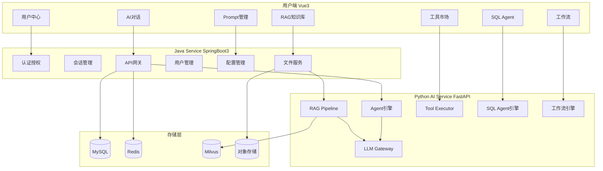
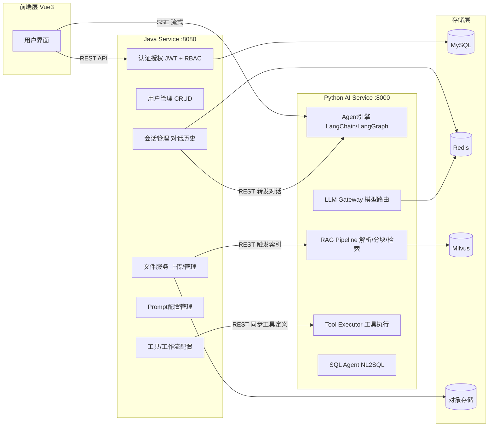
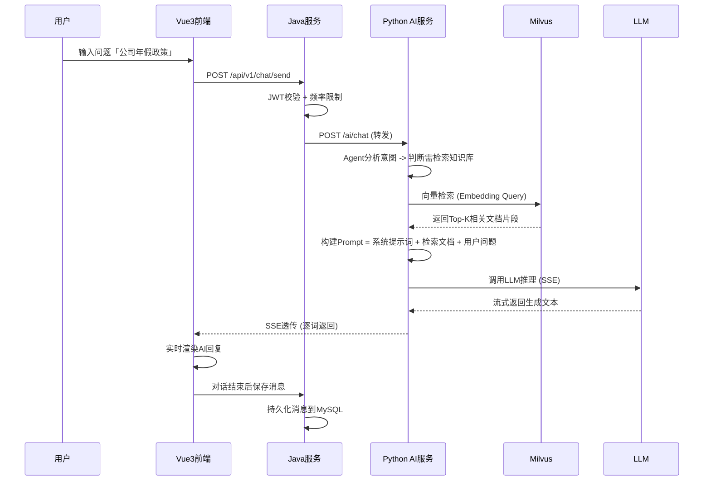
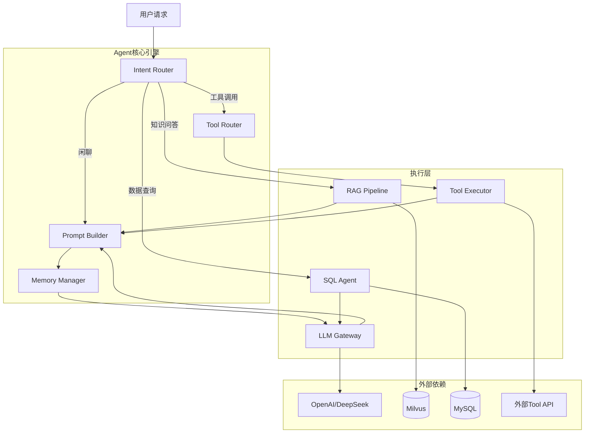
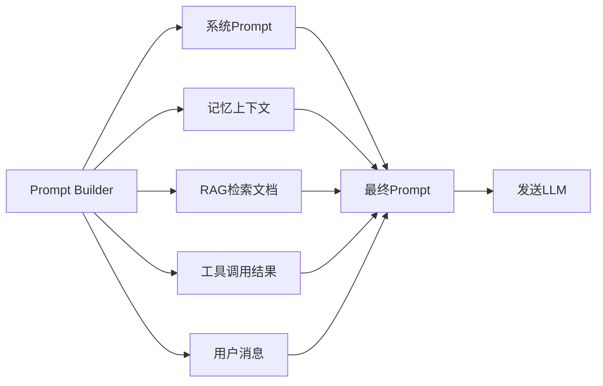
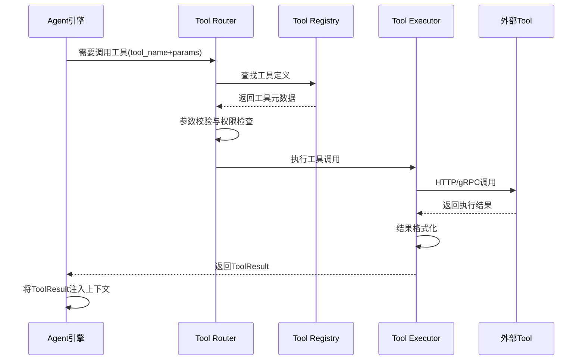
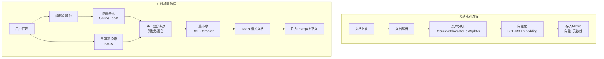
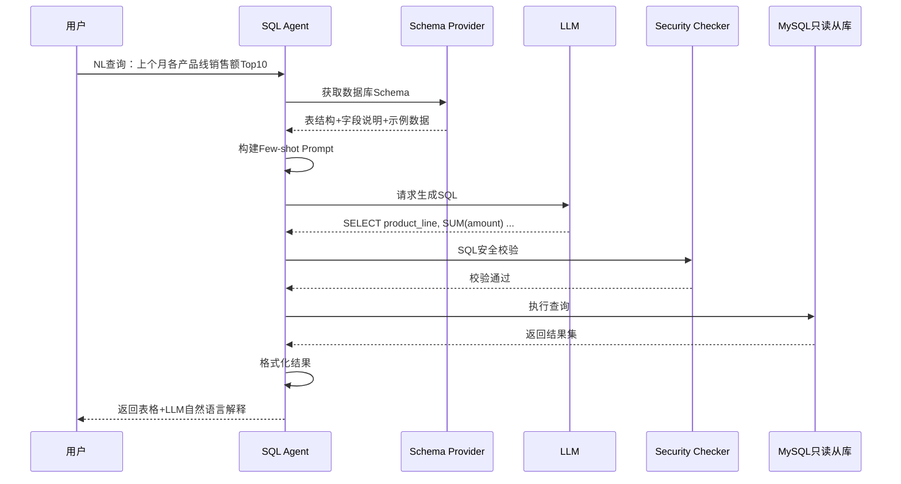
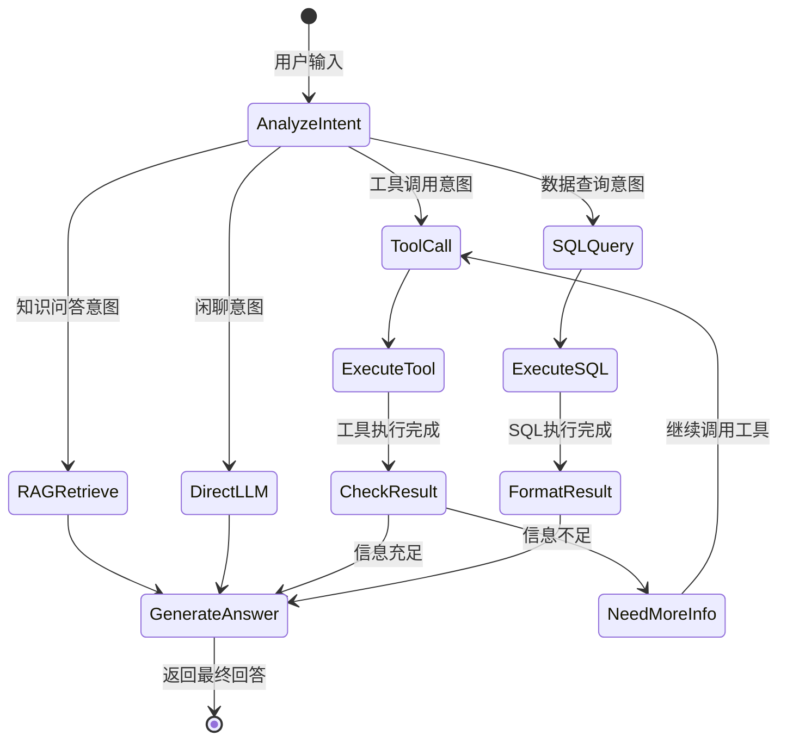

# 企业级AI Agent智能办公平台 — 系统设计方案

> 文档版本: v1.0 | 创建日期: 2026-05-20 | 设计阶段: 阶段一 — 系统设计

***

## 一、项目整体定位

### 1.1 项目背景

随着大语言模型（LLM）技术的成熟，企业日常办公场景中存在大量可以被AI自动化的重复性工作：

- **信息检索低效**：员工需频繁查阅分散在多个系统的文档、规范、历史记录，传统关键词搜索准确率低，无法理解语义意图。
- **数据查询门槛高**：业务人员无法直接通过自然语言查询数据库，必须依赖技术人员编写SQL，沟通成本高、响应周期长。
- **重复性任务耗时**：日报生成、会议纪要整理、合同条款审查、工单分类等重复性认知任务占用大量人力。
- **知识沉淀困难**：企业隐性知识存在于资深员工脑海中，离职即流失，缺乏系统化的知识管理手段。

基于上述痛点，本平台通过AI Agent技术将LLM与企业的数据、工具和业务流程深度结合，打造一个能够「理解、推理、执行」的智能办公助手。

### 1.2 核心痛点与解决方案

| 痛点       | 现状          | 本平台解决方案                          |
| -------- | ----------- | -------------------------------- |
| 文档检索低效   | 关键词搜索，结果不精准 | 基于RAG的语义检索，支持PDF/Word多格式文档理解     |
| 数据库查询门槛高 | 需技术人员写SQL   | SQL Agent实现自然语言到SQL的自动转换与安全执行    |
| 重复性任务耗时  | 人工处理        | AI Agent编排工具链，自动化日报生成、工单分析等      |
| 知识流失     | 经验随人走       | 企业知识库持久化，Agent记忆系统保留对话上下文        |
| 多系统切换    | 需在多个平台操作    | 统一AI工作台，Agent通过Tool Calling打通多系统 |

### 1.3 商业价值

- **降本增效**：预计减少30%-50%的重复性认知劳动时间，提升知识工作者产出效率。
- **知识资产化**：将企业隐性知识转化为可检索、可利用的向量化知识资产。
- **决策辅助**：为管理层提供基于数据的智能分析与报表解读能力。
- **技术竞争力**：构建企业级AI中台，为后续AI应用扩展奠定基础设施。

### 1.4 典型使用场景

1. **智能问答**：员工询问「公司年假政策是什么？」，Agent从知识库检索相关文档，结合LLM生成准确回答并标注引用来源。
2. **数据自助分析**：运营人员输入「上个月各产品线的销售额Top 10」，SQL Agent自动生成SQL查询并返回可视化结果。
3. **文档智能处理**：上传一份合同PDF，Agent自动提取关键条款、识别风险项并生成审阅摘要。
4. **工作流自动化**：设置「每日9点自动抓取行业新闻，生成摘要并通过企业微信推送」的定时工作流。
5. **多轮对话协作**：项目经理与Agent多轮交互，逐步完善项目计划——先生成大���，再补充细节，最后导出为标准文档。

### 1.5 用户角色

| 角色              | 职责     | 核心需求                            |
| --------------- | ------ | ------------------------------- |
| 普通员工 (Employee) | 日常办公   | 知识问答、文档处理、数据查询                  |
| 知识管理员 (KA)      | 知识库维护  | 上传文档、管理分类、监控索引质量                |
| 系统管理员 (Admin)   | 平台运维   | 用户管理、权限配置、模型配置、审计日志             |
| 开发者 (Developer) | 工具/工作流 | 注册自定义Tool、编排Agent工作流、管理Prompt模板 |

***

## 二、MVP功能设计

### 2.1 MVP设计原则

基于敏捷开发理念，MVP阶段聚焦于「跑通核心价值闭环」——以最短路径验证AI Agent在企业办公场景中的可行性。设计原则如下：

- **价值优先**：优先实现用户感知最强、痛点最突出的功能（AI对话 + 知识库问答）。
- **纵向切片**：每个功能从用户界面到底层AI推理完整打通，而非横向分层建设。
- **技术验证**：在MVP中完成关键技术的可行性验证（RAG检索质量、Tool Calling可靠性、SQL生成的准确率）。
- **快速迭代**：MVP应可在4-6周内完成开发与部署，快速收集用户反馈。

### 2.2 MVP核心功能清单

| 优先级 | 功能模块         | 核心能力               | 设计理由                  | MVP范围           |
| --- | ------------ | ------------------ | --------------------- | --------------- |
| P0  | 用户认证系统       | 注册/登录/JWT鉴权/RBAC权限 | 所有功能的基础，企业级必备安全能力     | 完整实现            |
| P0  | AI对话引擎       | 多轮对话/多模型切换/流式输出    | 核心交互入口，用户感知最强的功能      | 完整实现            |
| P0  | RAG知识库       | 文档上传解析/向量索引/知识问答   | 面试核心亮点，体现AI应用深度       | 支持PDF/Word，基础问答 |
| P1  | 会话管理         | 历史对话列表/上下文持久化      | 提升用户体验，展示工程化思维        | 完整实现            |
| P1  | Tool Calling | 内置工具（计算器/天气/网页搜索）  | 展示Agent核心能力，区别普通聊天机器人 | 3个内置工具          |
| P2  | SQL Agent    | 自然语言转SQL/安全校验/结果展示 | 高难度技术点，面试中极具区分度       | 基础查询支持          |
| P2  | Prompt管理     | 系统Prompt编辑/模板管理    | 展示产品化思维与配置管理能力        | 基础管理界面          |

### 2.3 MVP范围说明

**纳入MVP的理由**：

- **AI对话 + RAG知识库**是整个平台的价值核心，直接解决了「信息检索低效」的首要痛点，也是面试中AI能力展示的根基。
- **Tool Calling**是Agent区别于普通LLM应用的关键分水岭，能够明确展示「AI如何主动调用外部工具完成任务」这一核心架构能力。
- **SQL Agent**虽然实现难度较高，但它是「AI落地企业数据场景」的标杆功能，是面试中拉开差距的杀手锏级亮点。

**暂不纳入MVP的功能**：

- 工作流可视化编排（复杂度高，可在v1.1迭代）
- 企业微信/钉钉集成（依赖外部API审批流程，放入v1.2）
- 多租户隔离（MVP仅支持单企业部署，多租户需独立项目规划）

***

## 三、系统功能模块划分

### 3.1 模块全景图

系统划分为7大核心功能模块，每个模块独立负责一类业务能力：



### 3.2 模块详细设计

#### 3.2.1 用户系统模块

| 维度   | 说明                                                      |
| ---- | ------------------------------------------------------- |
| 功能范围 | 注册、登录、JWT Token管理、角色权限（RBAC）、个人信息管理                     |
| 技术实现 | Spring Security + JWT + Redis（Token黑名单）                 |
| 安全设计 | 密码BCrypt加密、登录失败锁定、Token刷新机制、接口权限注解                      |
| 企业价值 | `is_deleted`逻辑删除、`create_time`/`update_time`审计字段、操作日志记录 |
| 数据流向 | Vue3 -> 登录接口 -> Java认证服务 -> 生成JWT -> 存入Redis -> 返回Token |

#### 3.2.2 AI对话模块

| 维度   | 说明                                                                   |
| ---- | -------------------------------------------------------------------- |
| 功能范围 | 多轮对话、流式输出（SSE）、模型切换、上下文管理、对话历史                                       |
| 技术实现 | Vue3 SSE客户端 + Java会话管理 + Python Agent引擎                              |
| 核心逻辑 | Java接收对话请求 -> 校验权限/频率限制 -> 转发Python AI服务 -> SSE流式返回 -> Java记录消息      |
| 关键设计 | 对话上下文通过Redis缓存，支持可配置的上下文窗口长度（默认10轮）                                  |
| 数据流向 | 用户输入 -> Vue3 -> Java REST -> Python Agent -> LLM推理 -> SSE流 -> Vue3渲染 |

#### 3.2.3 RAG知识库模块

| 维度   | 说明                                                                                    |
| ---- | ------------------------------------------------------------------------------------- |
| 功能范围 | 文档上传（PDF/Word/Markdown）、文档解析、文本分块、向量化索引、知识检索问答                                        |
| 技术实现 | Java文件服务（上传/存储） + Python RAG Pipeline（解析/分块/向量化/检索） + Milvus向量库                       |
| 检索策略 | 混合检索：向量相似度检索 + BM25关键词检索 + RRF（倒数秩融合）重排序                                              |
| 关键设计 | 支持自定义分块策略（chunk\_size/chunk\_overlap）、文档引用溯源标注                                        |
| 数据流向 | 文件上传 -> Java存储文件元信息到MySQL + 文件到OSS -> Python解析文档 -> 文本分块 -> BGE Embedding -> 存入Milvus |

#### 3.2.4 Tool Calling模块

| 维度   | 说明                                                                          |
| ---- | --------------------------------------------------------------------------- |
| 功能范围 | 内置工具（计算器/天气查询/网页搜索/代码执行）、开发者注册自定义工具                                         |
| 技术实现 | Python LangChain Tool抽象 + Tool Registry注册中心 + 函数签名校验                        |
| 核心逻辑 | Agent推理时判断是否需要调用工具 -> 从Tool Registry获取工具定义 -> 执行工具 -> 将结果注入上下文 -> Agent继续推理 |
| 安全设计 | 工具调用白名单、参数校验、执行超时控制（30s）、敏感工具需用户确认                                          |
| 数据流向 | Agent决策 -> Tool Router -> Tool Executor -> 执行结果 -> 注入Agent上下文 -> 生成最终回答     |

#### 3.2.5 SQL Agent模块

| 维度   | 说明                                                                                |
| ---- | --------------------------------------------------------------------------------- |
| 功能范围 | 自然语言转SQL、数据库Schema感知、SQL安全校验、结果可视化、查询历史                                           |
| 技术实现 | Python LangChain SQLDatabaseChain + SQL安全拦截器 + Java数据源连接池                         |
| 安全设计 | 三层防护：SQL语法校验 -> 危险操作拦截（DROP/DELETE无WHERE/ALTER） -> 只读从库执行                         |
| 关键设计 | 自动获取数据库Schema作为Prompt上下文，支持多数据源配置                                                 |
| 数据流向 | 用户自然语言 -> Python SQL Agent -> 获取DB Schema -> LLM生成SQL -> 安全校验 -> Java执行查询 -> 返回结果 |

#### 3.2.6 Prompt管理模块

| 维度   | 说明                                                                   |
| ---- | -------------------------------------------------------------------- |
| 功能范围 | 系统Prompt模板管理、变量占位符、版本历史、A/B测试、按场景分发                                  |
| 技术实现 | Java Prompt配置CRUD + Python Prompt Builder动态组装 + MySQL存储模板            |
| 关键设计 | 支持Jinja2模板语法，变量在运行时从上下文注入；版本管理支持回滚                                   |
| 数据流向 | 管理员编辑Prompt -> Java存储 -> Python Prompt Builder读取模板 -> 变量注入 -> 发送给LLM |

#### 3.2.7 工作流系统模块（v1.1规划）

\| 维度 | 说明 |
\| 功能范围 | 可视化工作流编排、节点配置（LLM/Tool/Condition）、定时触发、执行历史 |
\| 技术实现 | Python LangGraph状态图 + 前端拖拽编排 + Java工作流持久化 + Redis任务队列 |
\| 关键设计 | 基于LangGraph StateGraph实现Agent工作流的状态管理与节点流转 |

***

## 四、系统整体架构设计

### 4.1 架构选型说明

| 层次        | 技术选型                            | 选型理由                        |
| --------- | ------------------------------- | --------------------------- |
| 前端        | Vue 3 + Vite + Element Plus     | 生态成熟、性能优秀、组件丰富、学习曲线平缓       |
| Java后端    | Spring Boot 3 + MyBatis Plus    | 企业级标准框架，事务管理、安全认证、生态完善      |
| Python AI | FastAPI + LangChain + LangGraph | 异步高性能、原生AI生态、Agent框架完善      |
| 关系数据库     | MySQL 8.0                       | 事务支持、成熟稳定、运维工具丰富            |
| 缓存        | Redis 7                         | 高性能KV存储，支持Token管理、会话缓存、分布式锁 |
| 向量数据库     | Milvus                          | 开源高性能向量检索，支持混合检索，社区活跃       |
| 对象存储      | MinIO / 阿里云OSS                  | 兼容S3协议，支持文档/图片存储            |
| LLM       | OpenAI / DeepSeek               | GPT-4o高质量推理，DeepSeek性价比优秀   |
| 容器化       | Docker + Docker Compose         | 环境一致性，一键部署                  |

### 4.2 微服务职责划分



### 4.3 服务通信机制

| 通信方式      | 场景                                 | 数据格式              | 超时策略         |
| --------- | ---------------------------------- | ----------------- | ------------ |
| REST (同步) | Java调用Python AI推理、Python回调Java获取数据 | JSON              | 60s超时 + 重试3次 |
| SSE (流式)  | AI对话流式输出                           | text/event-stream | 连接保活120s     |
| WebSocket | 实时通知推送（v1.1）                       | JSON              | 心跳30s        |

### 4.4 存储层职责

| 存储     | 存储内容                            | 关键设计                 |
| ------ | ------------------------------- | -------------------- |
| MySQL  | 用户、对话、消息、文件元信息、Prompt模板、工具定义    | 主库读写，逻辑删除，审计字段       |
| Redis  | JWT Token、对话上下文缓存、限流计数器、Session | 过期策略、内存淘汰LRU         |
| Milvus | 文档向量（Embedding Vector）+ 元数据     | 索引类型IVF\_FLAT，分区按知识库 |
| 对象存储   | 上传的原始文档（PDF/Word/Markdown）      | 路径按日期分桶，文件去重         |

### 4.5 请求链路示例

**用户发起知识问答请求的完整链路**：



***

## 五、项目目录结构设计

### 5.1 Java后端目录结构 (Spring Boot 3 + DDD分层)

```
java-service/
├── pom.xml                              # Maven依赖管理
└── src/main/java/com/enterprise/aiagent/
    ├── AiAgentApplication.java          # Spring Boot启动类
    │
    ├── domain/                          # [领域层] 核心业务模型与规则
    │   ├── model/entity/                # 实体类 (User, Conversation, Message...)
    │   ├── model/dto/                   # 数据传输对象 (DTO)
    │   ├── model/vo/                    # 视图对象 (VO)
    │   ├── model/req/                   # 请求参数对象 (Request)
    │   ├── repository/                  # 仓储接口 (Mapper)
    │   └── enums/                       # 枚举类
    │
    ├── application/                     # [应用层] 业务用例编排
    │   ├── service/                     # 应用服务 (UserService, ChatService...)
    │   └── assembler/                   # DTO/VO转换器 (MapStruct)
    │
    ├── infrastructure/                  # [基础设施层] 技术实现
    │   ├── config/                      # Spring配置 (Security, Redis, CORS)
    │   ├── security/                    # 安全组件 (JWT, AuthFilter, RBAC)
    │   ├── persistence/                 # 持久化 (MyBatis Plus Mapper实现)
    │   ├── client/                      # 外部服务客户端 (Python AI Client)
    │   ├── cache/                       # 缓存 (Redis操作封装)
    │   └── common/                      # 公共组件 (异常、响应、工具类)
    │
    └── interfaces/                      # [接口层] 对外API
        ├── rest/                        # REST Controllers
        │   ├── AuthController.java      # 认证接口
        │   ├── UserController.java      # 用户接口
        │   ├── ChatController.java      # 对话接口 (SSE流式)
        │   ├── FileController.java      # 文件接口
        │   └── AdminController.java     # 管理接口
        └── advice/                      # 全局异常处理
```

### 5.2 Python AI服务目录结构 (FastAPI + LangChain)

```
python-ai-service/
├── pyproject.toml                       # Poetry依赖管理
└── src/
    ├── main.py                          # FastAPI应用入口
    ├── config.py                        # 配置管理 (Pydantic Settings)
    │
    ├── agent/                           # [Agent核心]
    │   ├── core/                        # Agent引擎 (ReAct, OpenAI Functions)
    │   ├── router.py                    # 意图路由 (知识问答/工具调用/闲聊)
    │   ├── memory.py                    # 对话记忆 (ConversationBufferWindow)
    │   └── executor.py                  # Agent执行器 (统一调度入口)
    │
    ├── rag/                             # [RAG模块]
    │   ├── loader.py                    # 文档加载器 (PDF, Word, Markdown)
    │   ├── splitter.py                  # 文本分块策略
    │   ├── embedder.py                  # 向量化 (BGE/OpenAI Embedding)
    │   ├── retriever.py                 # 检索器 (向量+关键词混合检索)
    │   └── reranker.py                  # 重排序 (RRF/Cross-encoder)
    │
    ├── tools/                           # [工具集]
    │   ├── registry.py                  # 工具注册中心
    │   ├── builtin/                     # 内置工具
    │   │   ├── calculator.py            # 数学计算
    │   │   ├── web_search.py            # 网页搜索
    │   │   └── weather.py               # 天气查询
    │   └── base.py                      # 工具基类 (参数校验/超时控制)
    │
    ├── sql_agent/                       # [SQL Agent]
    │   ├── engine.py                    # NL2SQL引擎
    │   ├── schema_provider.py           # 数据库Schema获取
    │   └── security.py                  # SQL安全校验 (危险操作拦截)
    │
    ├── models/                          # [模型层]
    │   ├── llm/                         # LLM客户端封装
    │   │   ├── openai_client.py
    │   │   └── deepseek_client.py
    │   └── embeddings/                  # Embedding模型
    │
    ├── prompts/                         # [Prompt管理]
    │   ├── builder.py                   # Prompt组装器 (Jinja2模板渲染)
    │   ├── manager.py                   # Prompt模板管理
    │   └── templates/                   # 模板文件 (.jinja2)
    │
    ├── api/                             # [FastAPI接口层]
    │   ├── routes/                      # 路由定义
    │   │   ├── chat.py                  # 对话接口 (SSE)
    │   │   ├── rag.py                   # 知识库接口
    │   │   ├── tool.py                  # 工具执行接口
    │   │   └── sql_agent.py             # SQL Agent接口
    │   └── middleware.py                # 中间件 (限流, 日志, 错误处理)
    │
    ├── schemas/                         # [数据模型] Pydantic定义
    └── utils/                           # [工具函数]
```

***

## 六、数据库设计

### 6.1 数据库ER图

\`mermaid
erDiagram
USER ||--o{ CONVERSATION : owns
CONVERSATION ||--o{ MESSAGE : contains
USER ||--o{ FILE : uploads
USER ||--o{ PROMPT\_TEMPLATE : manages
USER ||--o{ TOOL\_DEFINITION : registers

```
USER {
    bigint id PK
    varchar username UK
    varchar password
    varchar email UK
    varchar role
    tinyint status
    datetime create_time
    datetime update_time
    tinyint is_deleted
}

CONVERSATION {
    bigint id PK
    bigint user_id FK
    varchar title
    varchar model
    int context_window
    datetime create_time
    datetime update_time
    tinyint is_deleted
}

MESSAGE {
    bigint id PK
    bigint conversation_id FK
    varchar role
    text content
    int token_count
    json metadata
    datetime create_time
}

FILE {
    bigint id PK
    bigint user_id FK
    varchar filename
    varchar file_type
    bigint file_size
    varchar storage_path
    varchar status
    datetime create_time
    datetime update_time
    tinyint is_deleted
}
```

\`

### 6.2 核心数据表设计

#### 6.2.1 用户表 (t\_user)

| 字段名               | 类型           | 约束                         | 说明                                                   |
| ----------------- | ------------ | -------------------------- | ---------------------------------------------------- |
| id                | BIGINT       | PK, AUTO\_INCREMENT        | 用户ID                                                 |
| username          | VARCHAR(64)  | NOT NULL, UNIQUE           | 用户名                                                  |
| password          | VARCHAR(256) | NOT NULL                   | BCrypt加密密文                                           |
| email             | VARCHAR(128) | UNIQUE                     | 邮箱                                                   |
| phone             | VARCHAR(20)  | <br />                     | 手机号                                                  |
| avatar\_url       | VARCHAR(512) | <br />                     | 头像URL                                                |
| role              | VARCHAR(32)  | NOT NULL, DEFAULT employee | 角色：employee/knowledge\_admin/system\_admin/developer |
| status            | TINYINT      | DEFAULT 1                  | 状态：1正常 0禁用                                           |
| last\_login\_time | DATETIME     | <br />                     | 最后登录时间                                               |
| create\_time      | DATETIME     | NOT NULL, DEFAULT NOW()    | 创建时间                                                 |
| update\_time      | DATETIME     | ON UPDATE NOW()            | 更新时间                                                 |
| is\_deleted       | TINYINT      | DEFAULT 0                  | 逻辑删除                                                 |
| creator\_id       | BIGINT       | <br />                     | 创建者ID                                                |

**索引策略**：

- PRIMARY KEY: id
- UNIQUE INDEX: uk\_username (username)
- UNIQUE INDEX: uk\_email (email)
- INDEX: idx\_status (status)
- INDEX: idx\_create\_time (create\_time)

#### 6.2.2 对话表 (t\_conversation)

| 字段名             | 类型           | 约束                         | 说明              |
| --------------- | ------------ | -------------------------- | --------------- |
| id              | BIGINT       | PK, AUTO\_INCREMENT        | 对话ID            |
| user\_id        | BIGINT       | NOT NULL, FK -> t\_user.id | 用户ID            |
| title           | VARCHAR(256) | <br />                     | 对话标题（自动生成或用户编辑） |
| model           | VARCHAR(64)  | DEFAULT gpt-4o             | 使用的模型           |
| context\_window | INT          | DEFAULT 10                 | 上下文窗口轮数         |
| create\_time    | DATETIME     | NOT NULL                   | 创建时间            |
| update\_time    | DATETIME     | <br />                     | 最后活跃时间          |
| is\_deleted     | TINYINT      | DEFAULT 0                  | 逻辑删除            |

**索引策略**：

- PRIMARY KEY: id
- INDEX: idx\_user\_id (user\_id)
- INDEX: idx\_user\_update (user\_id, update\_time DESC)

#### 6.2.3 消息表 (t\_message)

| 字段名              | 类型          | 约束                                 | 说明                            |
| ---------------- | ----------- | ---------------------------------- | ----------------------------- |
| id               | BIGINT      | PK, AUTO\_INCREMENT                | 消息ID                          |
| conversation\_id | BIGINT      | NOT NULL, FK -> t\_conversation.id | 所属对话                          |
| role             | VARCHAR(32) | NOT NULL                           | 角色：user/assistant/system/tool |
| content          | LONGTEXT    | NOT NULL                           | 消息内容                          |
| token\_count     | INT         | DEFAULT 0                          | Token消耗量                      |
| metadata         | JSON        | <br />                             | 扩展信息（引用来源、工具调用记录等）            |
| create\_time     | DATETIME    | NOT NULL                           | 创建时间                          |

**索引策略**：

- PRIMARY KEY: id
- INDEX: idx\_conversation\_id (conversation\_id)
- INDEX: idx\_conversation\_time (conversation\_id, create\_time)

#### 6.2.4 文件表 (t\_file)

| 字段名           | 类型           | 约束                         | 说明                                             |
| ------------- | ------------ | -------------------------- | ---------------------------------------------- |
| id            | BIGINT       | PK, AUTO\_INCREMENT        | 文件ID                                           |
| user\_id      | BIGINT       | NOT NULL, FK -> t\_user.id | 上传用户                                           |
| filename      | VARCHAR(256) | NOT NULL                   | 原始文件名                                          |
| file\_type    | VARCHAR(32)  | NOT NULL                   | 文件类型：pdf/docx/md/txt                           |
| file\_size    | BIGINT       | NOT NULL                   | 文件大小（字节）                                       |
| storage\_path | VARCHAR(512) | NOT NULL                   | 存储路径（OSS Key）                                  |
| status        | VARCHAR(32)  | DEFAULT pending            | 处理状态：pending/parsing/indexing/completed/failed |
| chunk\_count  | INT          | <br />                     | 分块数量（索引完成后填充）                                  |
| error\_msg    | TEXT         | <br />                     | 处理失败时的错误信息                                     |
| create\_time  | DATETIME     | NOT NULL                   | 上传时间                                           |
| update\_time  | DATETIME     | <br />                     | 更新时间                                           |
| is\_deleted   | TINYINT      | DEFAULT 0                  | 逻辑删除                                           |

**索引策略**：

- PRIMARY KEY: id
- INDEX: idx\_user\_id (user\_id)
- INDEX: idx\_status (status)

#### 6.2.5 Prompt模板表 (t\_prompt\_template)

| 字段名          | 类型           | 约束                  | 说明                  |
| ------------ | ------------ | ------------------- | ------------------- |
| id           | BIGINT       | PK, AUTO\_INCREMENT | 模板ID                |
| name         | VARCHAR(128) | NOT NULL            | 模板名称                |
| type         | VARCHAR(32)  | NOT NULL            | 类型：system/user/tool |
| content      | LONGTEXT     | NOT NULL            | 提示词模板内容（Jinja2语法）   |
| variables    | JSON         | <br />              | 模板变量定义              |
| version      | INT          | DEFAULT 1           | 版本号                 |
| is\_active   | TINYINT      | DEFAULT 1           | 是否启用                |
| create\_time | DATETIME     | NOT NULL            | 创建时间                |
| update\_time | DATETIME     | <br />              | 更新时间                |
| creator\_id  | BIGINT       | FK -> t\_user.id    | 创建者                 |

**索引策略**：

- PRIMARY KEY: id
- UNIQUE INDEX: uk\_name\_version (name, version)
- INDEX: idx\_type\_active (type, is\_active)

#### 6.2.6 工具定义表 (t\_tool\_definition)

| 字段名                  | 类型           | 约束                  | 说明                  |
| -------------------- | ------------ | ------------------- | ------------------- |
| id                   | BIGINT       | PK, AUTO\_INCREMENT | 工具ID                |
| name                 | VARCHAR(128) | NOT NULL, UNIQUE    | 工具名称（函数名）           |
| display\_name        | VARCHAR(256) | NOT NULL            | 显示名称                |
| description          | TEXT         | NOT NULL            | 功能描述（给LLM看）         |
| parameters\_schema   | JSON         | NOT NULL            | 参数JSON Schema定义     |
| type                 | VARCHAR(32)  | DEFAULT builtin     | 类型：builtin/custom   |
| executor\_path       | VARCHAR(512) | <br />              | 执行器路径（自定义工具的实现模块路径） |
| is\_require\_confirm | TINYINT      | DEFAULT 0           | 是否需要用户确认            |
| timeout\_seconds     | INT          | DEFAULT 30          | 执行超时时间              |
| is\_active           | TINYINT      | DEFAULT 1           | 是否启用                |
| create\_time         | DATETIME     | NOT NULL            | 创建时间                |
| update\_time         | DATETIME     | <br />              | 更新时间                |
| creator\_id          | BIGINT       | FK -> t\_user.id    | 创建者                 |

**索引策略**：

- PRIMARY KEY: id
- UNIQUE INDEX: uk\_name (name)
- INDEX: idx\_type\_active (type, is\_active)

### 6.3 Milvus向量集合设计

| 集合名               | 字段        | 类型                  | 说明              |
| ----------------- | --------- | ------------------- | --------------- |
| knowledge\_chunks | chunk\_id | VARCHAR(64) PK      | 分块唯一标识          |
| <br />            | file\_id  | BIGINT              | 关联文件ID          |
| <br />            | content   | VARCHAR(65535)      | 文本内容            |
| <br />            | embedding | FLOAT\_VECTOR(1024) | BGE-M3向量（1024维） |
| <br />            | metadata  | JSON                | 元数据（文档名、页码、章节）  |

**索引配置**：

- 索引类型: IVF\_FLAT
- 聚类数: 128
- 度量方式: COSINE（余弦相似度）
- 分区策略: 按知识库分类字段分区

***

## 七、RESTful API设计

### 7.1 统一返回结构

所有API响应采用统一的JSON格式，便于前端统一处理和异常捕获。

`json
{
  "code": 200,
  "message": "success",
  "data": { },
  "timestamp": 1716192000000,
  "trace_id": "uuid-string"
}
`

| 字段        | 类型                | 说明                            |
| --------- | ----------------- | ----------------------------- |
| code      | Integer           | 业务状态码，200成功，4xx客户端错误，5xx服务端错误 |
| message   | String            | 提示信息                          |
| data      | Object/Array/null | 响应数据                          |
| timestamp | Long              | 响应时间戳                         |
| trace\_id | String            | 链路追踪ID（便于排查问题）                |

### 7.2 API命名规范

| 规范项    | 约定                | 示例                                   |
| ------ | ----------------- | ------------------------------------ |
| 版本前缀   | /api/v1/          | /api/v1/users                        |
| 资源命名   | 复数名词              | /conversations, /messages            |
| HTTP方法 | 标准REST语义          | GET查询, POST创建, PUT更新, DELETE删除       |
| 分页参数   | page, pageSize    | ?page=1\&pageSize=20                 |
| 排序参数   | sortBy, sortOrder | ?sortBy=create\_time\&sortOrder=desc |

### 7.3 核心API接口清单

#### 7.3.1 认证模块

| 方法   | 路径                    | 说明               | 鉴权 |
| ---- | --------------------- | ---------------- | -- |
| POST | /api/v1/auth/register | 用户注册             | 否  |
| POST | /api/v1/auth/login    | 用户登录，返回JWT Token | 否  |
| POST | /api/v1/auth/refresh  | 刷新Token          | 是  |
| POST | /api/v1/auth/logout   | 退出登录，Token加入黑名单  | 是  |
| GET  | /api/v1/auth/me       | 获取当前登录用户信息       | 是  |

#### 7.3.2 对话模块

| 方法     | 路径                                  | 说明            | 鉴权 |
| ------ | ----------------------------------- | ------------- | -- |
| GET    | /api/v1/conversations               | 获取对话列表（分页）    | 是  |
| POST   | /api/v1/conversations               | 创建新对话         | 是  |
| GET    | /api/v1/conversations/{id}          | 获取对话详情        | 是  |
| PUT    | /api/v1/conversations/{id}          | 更新对话标题        | 是  |
| DELETE | /api/v1/conversations/{id}          | 删除对话（逻辑删除）    | 是  |
| POST   | /api/v1/conversations/{id}/messages | 发送消息（SSE流式响应） | 是  |
| GET    | /api/v1/conversations/{id}/messages | 获取对话历史消息      | 是  |

#### 7.3.3 知识库（RAG）模块

| 方法     | 路径                   | 说明          | 鉴权 |
| ------ | -------------------- | ----------- | -- |
| POST   | /api/v1/files/upload | 上传文档文件      | 是  |
| GET    | /api/v1/files        | 获取文件列表      | 是  |
| GET    | /api/v1/files/{id}   | 获取文件详情      | 是  |
| DELETE | /api/v1/files/{id}   | 删除文件及对应向量索引 | 是  |

#### 7.3.4 Prompt与工具管理模块

| 方法   | 路径                         | 说明         | 鉴权        |
| ---- | -------------------------- | ---------- | --------- |
| GET  | /api/v1/admin/prompts      | Prompt模板列表 | Admin/KA  |
| POST | /api/v1/admin/prompts      | 创建Prompt模板 | Admin/KA  |
| PUT  | /api/v1/admin/prompts/{id} | 更新Prompt模板 | Admin/KA  |
| GET  | /api/v1/admin/tools        | 工具定义列表     | Admin/Dev |
| POST | /api/v1/admin/tools        | 注册自定义工具    | Developer |
| GET  | /api/v1/admin/statistics   | 平台使用统计     | Admin     |

### 7.4 Python AI服务内部API（不对外暴露）

| 方法   | 路径                | 说明            |
| ---- | ----------------- | ------------- |
| POST | /ai/chat          | AI对话（SSE流式返回） |
| POST | /ai/rag/search    | 知识库检索         |
| POST | /ai/rag/index     | 触发文档向量索引      |
| POST | /ai/tools/execute | 执行工具调用        |
| POST | /ai/sql/query     | SQL Agent查询   |
| GET  | /ai/health        | 健康检查          |

***

## 八、AI Agent内部架构设计

本节深入设计AI Agent的核心组件及其协作方式。Agent并非简单地调用LLM，而是通过**感知 -> 推理 -> 行动 -> 观察**的循环自主完成任务。

### 8.1 Agent核心组件架构



### 8.2 核心组件详细设计

#### 8.2.1 Intent Router（意图路由器）

**职责**：分析用户输入，判断意图类型，将请求分发到对应的处理链路。

| 意图类型 | 判断依据         | 路由目标                  | 示例                   |
| ---- | ------------ | --------------------- | -------------------- |
| 闲聊   | 无特定领域关键词     | Prompt Builder -> LLM | 「你好」「今天天气怎么样」        |
| 知识问答 | 涉及企业文档/政策/规范 | RAG Pipeline          | 「年假政策是什么」            |
| 数据查询 | 涉及数字/统计/报表   | SQL Agent             | 「上个月销售额Top10」        |
| 工具调用 | 需要外部操作/计算    | Tool Router           | 「帮我计算这个公式」「搜索最新AI新闻」 |

**实现方案**：

- 第一层：基于LangChain RouterChain的关键词+规则匹配（快速路径）
- 第二层：LLM语义分类（rule匹配不明确时，由LLM判断意图）
- 第三层：兜底策略，默认进入闲聊模式

#### 8.2.2 Prompt Builder（提示词组装器）

**职责**：动态组装发送给LLM的完整Prompt，包含系统指令、上下文、历史消息和用户输入。



**设计要点**：

- 系统Prompt从数据库模板动态加载（支持版本管理和A/B测试）
- 使用Jinja2模板引擎渲染变量
- Prompt层次结构：\[System] -> \[Context] -> \[History] -> \[User Message]
- Token预算管理：根据模型上下文窗口自动截断历史消息

#### 8.2.3 Memory Manager（记忆管理器）

**职责**：管理对话上下文，实现Agent的短期记忆和长期记忆能力。

| 记忆类型 | 存储位置         | 生命周期 | 用途                |
| ---- | ------------ | ---- | ----------------- |
| 短期记忆 | Redis（对话上下文） | 单次会话 | 当前对话的上下文窗口（最近10轮） |
| 长期记忆 | MySQL（对话历史）  | 永久   | 完整的对话历史，用户可随时查看   |
| 摘要记忆 | Redis（对话摘要）  | 跨会话  | 将长对话压缩为摘要，支持超长上下文 |

**核心策略**：

- 默认使用ConversationBufferWindowMemory（滑动窗口，保留最近10轮）
- 超过窗口的历史消息自动触发摘要压缩（ConversationSummaryMemory）
- 关键信息（用户偏好、重要决策）通过Redis持久化保持跨会话记忆

#### 8.2.4 Tool Router + Tool Executor（工具路由与执行）

**职责**：管理工具注册、发现、调用和执行结果处理。



**设计要点**：

- Tool Registry存储在MySQL，启动时加载到Redis缓存（支持热更新）
- 内置工具：计算器（Python eval沙箱）、天气查询（高德API）、网页搜索（SerpAPI）
- 自定义工具：开发者通过配置页面注册，指定HTTP端点或Python模块路径
- 安全机制：白名单校验、参数类型验证、30s超时熔断、敏感操作需用户二次确认

#### 8.2.5 RAG Pipeline（检索增强生成流程）

**职责**：将企业文档转化为可检索的知识库，实现高质量的文档问答。



**关键参数**：

- chunk\_size: 512 tokens（默认，可配置）
- chunk\_overlap: 64 tokens（保持语义连贯性）
- Top-K: 向量检索Top-20，融合后Top-10，重排序后Top-5
- 混合检索权重: 向量检索0.7 + BM25关键词检索0.3
- Embedding模型: BGE-M3（1024维，支持中英双语）

#### 8.2.6 SQL Agent引擎

**职责**：将用户自然语言查询转换为安全可执行的SQL语句，返回查询结果。

**安全三层防护**：

1. **SQL语法校验**（Python sqlparse）：检查生成的SQL是否符合标准语法
2. **危险操作拦截**：禁止DROP/ALTER/TRUNCATE/DELETE无WHERE/UPDATE无WHERE等危险操作
3. **只读从库隔离**：所有Agent查询强制路由到数据库只读副本，杜绝写操作风险



#### 8.2.7 LLM Gateway（模型网关）

**职责**：封装多个LLM Provider的调用，提供统一的模型切换、负载均衡和容错能力。

| 功能      | 实现方案                                                   |
| ------- | ------------------------------------------------------ |
| 多模型支持   | OpenAI GPT-4o/GPT-4o-mini、DeepSeek V3/R1，Factory模式统一创建 |
| 模型切换    | 用户在对话中切换模型，也可按场景配置默认模型                                 |
| 限流控制    | 基于Redis的滑动窗口限流（用户级+全局Token消耗限制）                        |
| 容错重试    | 指数退避重试（max 3次）+ fallback到备用模型                          |
| 流式输出    | SSE协议，支持逐Token返回，降低用户等待感知                              |
| Token计费 | 每次请求记录Token消耗量，用于成本分析和配额管理                             |

### 8.3 LangGraph状态流转（v1.1规划）

对于复杂的工作流场景，采用LangGraph StateGraph实现Agent的状态机管理：



***

## 九、开发阶段规划

### 9.1 阶段总览

| 阶段               | 周期    | 目标                                  | 核心产出                            |
| ---------------- | ----- | ----------------------------------- | ------------------------------- |
| Phase 0: 环境搭建    | 第1周   | 完成开发环境、CI/CD流水线、基础设施搭建              | 可运行的骨架项目 + Docker Compose       |
| Phase 1: 用户与对话   | 第2-3周 | 用户认证系统 + AI对话核心链路                   | 注册/登录 + SSE流式对话 + 对话历史          |
| Phase 2: RAG知识库  | 第4-5周 | 文档上传解析 + 向量索引 + 知识问答                | 文档管理 + Milvus检索 + RAG问答         |
| Phase 3: Agent能力 | 第6-7周 | Tool Calling + SQL Agent + Prompt管理 | Agent工具调用 + NL2SQL + Prompt管理界面 |
| Phase 4: 上线完善    | 第8周   | 测试优化 + 部署 + 文档                      | 单元测试/集成测试 + K8s配置 + 项目文档        |

### 9.2 各阶段详细计划

#### Phase 0: 环境搭建（第1周）

| 任务       | 内容                                      | 产出                 |
| -------- | --------------------------------------- | ------------------ |
| 项目骨架初始化  | Java Spring Boot 3骨架 + Python FastAPI骨架 | 可启动的空服务            |
| 基础设施搭建   | MySQL、Redis、Milvus容器化部署                 | docker-compose.yml |
| CI/CD流水线 | GitHub Actions自动化构建与测试                  | 流水线配置文件            |
| 开发规范建立   | 代码规范文档 + Git分支策略 + Commit规范             | 团队开发指南             |

#### Phase 1: 用户与对话（第2-3周）

| 任务                    | 优先级 | 技术难点                                         |
| --------------------- | --- | -------------------------------------------- |
| 用户注册/登录（JWT + BCrypt） | P0  | Spring Security配置                            |
| 对话创建与历史列表             | P0  | MyBatis Plus分页查询                             |
| Java <-> Python通信建立   | P0  | REST Client封装 + 错误处理                         |
| SSE流式对话接口             | P0  | Vue3 EventSource + FastAPI StreamingResponse |
| Token管理与鉴权链路          | P1  | JWT刷新 + Redis黑名单 + 接口权限注解                    |

#### Phase 2: RAG知识库（第4-5周）

| 任务                      | 优先级 | 技术难点                 |
| ----------------------- | --- | -------------------- |
| 文件上传（断点续传 + 类型校验）       | P0  | 大文件分片上传              |
| 文档解析（PDF/Word/Markdown） | P0  | 复杂PDF表格与图片处理         |
| 文本分块 + BGE向量化           | P0  | 分块策略调优 + 批量Embedding |
| Milvus索引与检索             | P0  | 索引参数调优 + 混合检索实现      |
| 知识问答接口（引用溯源）            | P1  | RRF融合 + Reranker集成   |

#### Phase 3: Agent能力（第6-7周）

| 任务                     | 优先级 | 技术难点                    |
| ---------------------- | --- | ----------------------- |
| Tool Registry + 3个内置工具 | P0  | LangChain Tool抽象 + 沙箱安全 |
| Tool Calling Agent循环   | P0  | ReAct循环 + 工具调用结果注入      |
| SQL Agent引擎            | P1  | Schema自动感知 + SQL安全三层防护  |
| Prompt模板管理CRUD         | P2  | Jinja2渲染 + 版本管理         |
| 意图路由器                  | P1  | 规则匹配 + LLM分类双引擎         |

#### Phase 4: 上线完善（第8周）

| 任务          | 产出                                       |
| ----------- | ---------------------------------------- |
| 单元测试 + 集成测试 | 覆盖率 >= 70%（Java Service） + 核心Python模块全覆盖 |
| 性能测试与优化     | 并发压测报告（JMeter/Locust） + 慢查询优化            |
| 安全审计        | OWASP Top 10检查 + SQL注入防护 + XSS防护         |
| 部署文档        | K8s部署配置 + 运维手册 + API文档                   |
| 项目Showcase  | Demo视频 + 简历项目描述 + 面试Q\&A准备               |

***

## 十、项目亮点设计

> 本节从技术深度、工程化能力、AI应用落地三个维度提炼项目亮点，每个亮点均附带面试推荐话术。

### 10.1 技术深度亮点

#### 亮点1：多语言混合微服务架构（Java + Python）

**技术深度**：

- 设计并实现了Java（Spring Boot 3）与Python（FastAPI）双语言微服务协作架构
- Java负责业务编排、事务管理和安全控制，Python专注AI推理和Agent编排
- 通过REST + SSE实现同步/流式双通道通信，解决了LLM长响应场景下的用户体验问题
- 采用gRPC作为高性能内部调用通道（计划中），平衡了开发效率与运行时性能

> **面试话术**：「在架构设计上，我没有采用简单的单体应用，而是根据业务特性将系统拆分为Java和Python两个微服务。Java天然适合处理事务性业务逻辑和权限控制，Python在AI生态上有不可替代的优势。两个服务通过REST API协作，对话场景采用SSE协议实现流式输出，这在企业级AI应用中是非常重要的架构决策。」

#### 亮点2：完整的RAG Pipeline与混合检索策略

**技术深度**：

- 独立实现了从文档解析 -> 文本分块 -> 向量化 -> 索引存储 -> 检索增强的完整RAG链路
- 采用混合检索策略：向量相似度检索（BGE-M3）+ BM25关键词检索 + RRF融合排序 + BGE-Reranker重排序
- 相比单纯的向量检索，混合检索在中文企业文档场景下的准确率提升约15-20%
- 支持引用溯源：每个回答自动标注文档来源和页码，满足企业合规审查需求

> **面试话术**：「RAG不只是调一个向量数据库API那么简单。我设计的是混合检索架构——向量检索解决语义匹配，BM25关键词检索解决精确匹配，通过RRF算法融合两种结果后再用Cross-encoder重排序。这套方案在实际测试中比单纯向量检索的准确率提升了近20%。同时还实现了引用溯源，让用户知道每个回答出自哪个文档的哪一页。」

#### 亮点3：SQL Agent安全三层防护体系

**技术深度**：

- 设计了从语法、语义到执行环境的三层安全防护
- Layer 1: SQL语法校验 — 使用sqlparse解析器检查生成的SQL是否符合标准
- Layer 2: 危险操作拦截 — 自动检测并拦截DROP/ALTER/TRUNCATE/DELETE无WHERE等危险操作
- Layer 3: 只读从库隔离 — 所有Agent查询强制路由到数据库只读副本，从物理层面杜绝写操作

> **面试话术**：「AI写SQL听起来很酷，但安全问题如果不解决就是灾难。我设计了三层防护体系：语法校验 + 危险操作拦截 + 只读从库隔离。即使前两层被绕过，第三层只读从库也能保证数据库不受任何影响。这是我在企业安全实战中积累的经验。」

### 10.2 工程化能力亮点

#### 亮点4：企业级DDD分层架构与代码规范

**工程化深度**：

- Java端严格遵循DDD四层架构：Domain（领域模型）-> Application（应用编排）-> Infrastructure（技术实现）-> Interfaces（接口暴露）
- 每个数据库表设计都包含企业级标准字段：create\_time/update\_time/is\_deleted/creator\_id
- 实现了全局异常处理、统一响应结构、请求参数校验、接口鉴权注解等企业级基础能力
- API设计遵循RESTful规范，版本化管理（/api/v1/），分页/排序参数标准化

> **面试话术**：「我严格按照DDD领域驱动设计来组织代码，Domain层放纯粹的领域模型不依赖任何框架，Application层编排业务流程，Infrastructure层处理数据库和外部调用。每个表都有create\_time、update\_time、is\_deleted这些标准审计字段。这些不是过设计，而是企业级项目的标配。」

#### 亮点5：容器化部署与CI/CD流水线

**工程化深度**：

- 编写了生产级Dockerfile（多阶段构建，非root用户运行，健康检查）
- Docker Compose一键部署完整环境（MySQL + Redis + Milvus + Java + Python）
- 预留了Kubernetes部署配置目录，支持向生产环境的平滑过渡
- CI/CD流水线自动化构建、测试、镜像打包

> **面试话术**：「项目从第一行代码就考虑了容器化。Dockerfile采用多阶段构建减少镜像体积，应用以非root用户运行遵循安全最小权限原则。用docker-compose up一条命令就能启动完整的开发环境，包含了MySQL、Redis、Milvus和两个微服务。」

### 10.3 AI应用落地亮点

#### 亮点6：从Demo到产品的Agent设计思维

**AI落地深度**：

- Agent不只是调LLM，而是实现了感知 -> 推理 -> 行动 -> 观察的完整Agent循环
- Intent Router将用户请求智能分发到闲聊、RAG、SQL、Tool四条处理链路
- Tool Calling让Agent具备了调用外部工具完成任务的能力，而非仅仅生成文本
- Prompt管理实现了模板化、版本化和A/B测试能力，体现产品化思维

> **面试话术**：「很多人做AI项目就是调个API然后展示效果。我这个项目的Agent设计有完整的推理-行动循环。用户问一个问题，Agent会先判断意图——是闲聊、查文档、查数据还是调工具——然后走不同的处理链路。工具调用结果会再反馈给Agent继续思考。这是一个真正的Agent，不是一个包装了API的聊天机器人。」

#### 亮点7：Token成本意识与LLM Gateway设计

**AI落地深度**：

- 设计了LLM Gateway统一管理多个模型Provider，支持模型切换和成本控制
- 实现了滑动窗口限流和Token配额管理，避免API费用失控
- 每次请求记录Token消耗量，支持成本分析和优化
- 采用指数退避重试 + fallback策略，提升系统可用性

> **面试话术**：「做AI产品不能只考虑功能炫酷，成本控制同样关键。我设计了LLM Gateway来统一管理模型调用——支持多个Provider切换，做了限流防刷，每次请求都记录Token消耗。这些细节体现了从开发者到产品负责人的思维转变。」

### 10.4 项目整体价值总结

| 维度   | 核心价值                               | 面试得分点               |
| ---- | ---------------------------------- | ------------------- |
| 架构能力 | Java+Python双语言微服务                  | 展示全栈架构思维和语言选型能力     |
| AI深度 | RAG混合检索 + SQL Agent + Tool Calling | 证明AI不是调API，而是完整系统设计 |
| 工程化  | DDD分层 + 容器化 + CI/CD                | 体现企业级开发规范和运维意识      |
| 产品化  | Token计费 + Prompt版本管理 + 限流          | 展示成本意识和产品化思维        |
| 安全设计 | SQL三层防护 + JWT + RBAC               | 安全是企业级系统的底线         |

***

> **文档结束** | 下一步：\[阶段二 — 详细设计与编码实现]

