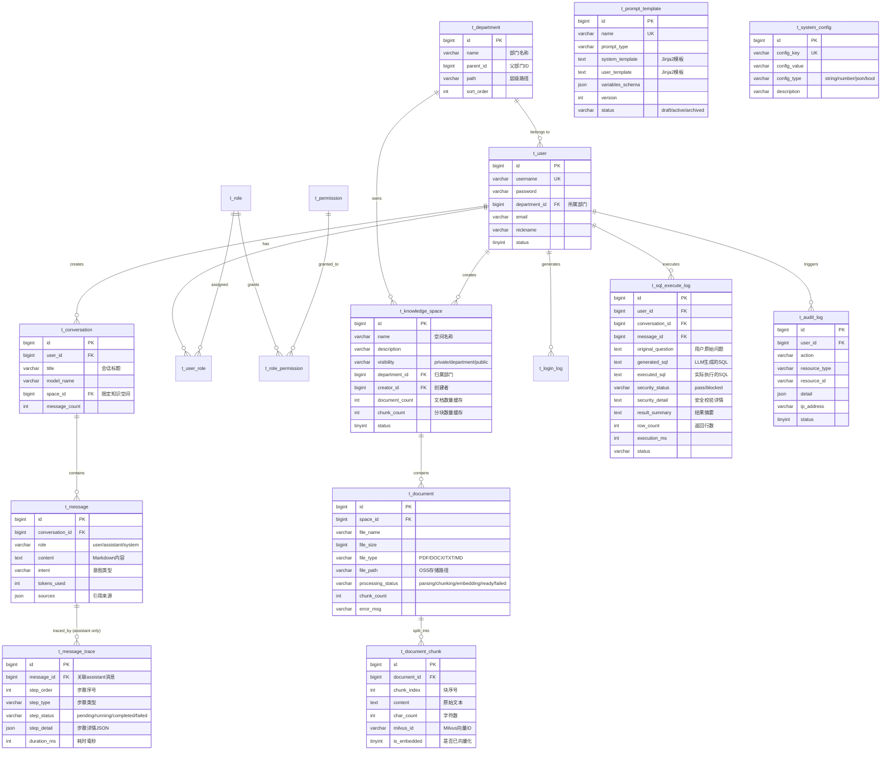

# InternSU 数据库与数据模型设计 v1.0

> 文档版本: v1.0 | 创建日期: 2026-05-26 | 定位: 底层数据结构定义
> 关联文档: [01-product-definition.md](01-product-definition.md)

---

## 一、数据库表总览

系统共设计 **17 张业务表**，按模块分为 6 组。

| 序号 | 表名 | 模块 | 说明 |
|------|------|------|------|
| 1 | `t_department` | 组织架构 | 部门/组织树 |
| 2 | `t_user` | 用户认证 | 用户账号（已有，增强） |
| 3 | `t_role` | 用户认证 | 角色定义（已有） |
| 4 | `t_permission` | 用户认证 | 权限定义（已有） |
| 5 | `t_user_role` | 用户认证 | 用户-角色关联（已有） |
| 6 | `t_role_permission` | 用户认证 | 角色-权限关联（已有） |
| 7 | `t_login_log` | 用户认证 | 登录日志（已有） |
| 8 | `t_knowledge_space` | 知识空间 | 知识空间（重建） |
| 9 | `t_document` | 知识空间 | 文档元数据 |
| 10 | `t_document_chunk` | 知识空间 | 文档分块（MySQL侧元数据） |
| 11 | `t_conversation` | 对话会话 | 对话会话（增强） |
| 12 | `t_message` | 对话会话 | 对话消息（增强） |
| 13 | `t_message_trace` | 对话会话 | 实习生工作过程追踪 |
| 14 | `t_sql_execute_log` | SQL安全 | SQL执行审计日志 |
| 15 | `t_prompt_template` | Prompt管理 | Prompt模板（增强） |
| 16 | `t_system_config` | 系统配置 | 系统级配置项 |
| 17 | `t_audit_log` | 审计日志 | 操作审计（已有） |

> **已有表**（2/3/4/5/6/7/17）：V1__init_auth.sql 已建好，本次仅做字段补充，不重建。
> **保留但 MVP 不暴露的表**：t_tool_definition、t_tool_call_log、t_workflow、t_workflow_node、t_workflow_execution（V2 已建，留作后续扩展）。

---

## 二、Mermaid ER 图



---

## 三、表详细设计

### 3.1 组织架构模块

#### t_department（部门表）— **新增**

部门/组织树结构，是知识空间可见性判断的基础锚点。

| 字段 | 类型 | 必填 | 说明 |
|------|------|------|------|
| `id` | BIGINT | ✅ | 主键，自增 |
| `name` | VARCHAR(128) | ✅ | 部门名称，如"技术部"、"产品部" |
| `parent_id` | BIGINT | | 父部门ID，NULL=顶级部门 |
| `path` | VARCHAR(512) | | 层级路径，如 `/1/3/15`，便于子树查询 |
| `sort_order` | INT | | 排序号，默认0 |
| `leader_id` | BIGINT | | 部门负责人用户ID |
| `status` | TINYINT | ✅ | 1=正常 0=禁用 |
| `create_time` | DATETIME | ✅ | 创建时间 |
| `update_time` | DATETIME | | 更新时间 |
| `is_deleted` | TINYINT | ✅ | 逻辑删除：0=正常 1=已删除 |

**索引**：
- `PRIMARY KEY (id)`
- `INDEX idx_parent_id (parent_id)`
- `INDEX idx_path (path)`

**设计要点**：
- `path` 字段让"查询某部门及其所有子部门"不需要递归CTE，`WHERE path LIKE '/1/3/%'` 即可
- `leader_id` 为后续审批/管理功能预留

---

#### t_user（用户表）— **增强现有**

在现有 V1 表基础上增加 `department_id`。

**新增字段**：

| 字段 | 类型 | 必填 | 说明 |
|------|------|------|------|
| `department_id` | BIGINT | | 所属部门ID，FK → `t_department.id` |

**新增索引**：
- `INDEX idx_department_id (department_id)`

> 其余字段（username/password/email/nickname/status/create_time 等）保持不变。

---

### 3.2 知识空间模块

这是 InternSU 的核心数据模型。**`t_knowledge_space` 替代 FlowMind 原有的 `t_knowledge_base`**，核心变化是权限模型从 tenant 隔离改为 department + visibility 可见性。

#### t_knowledge_space（知识空间表）— **重建**

| 字段 | 类型 | 必填 | 说明 |
|------|------|------|------|
| `id` | BIGINT | ✅ | 主键，自增 |
| `name` | VARCHAR(128) | ✅ | 知识空间名称，如"技术部开发规范" |
| `description` | VARCHAR(512) | | 描述说明 |
| `visibility` | VARCHAR(16) | ✅ | 可见范围：`private` / `department` / `public` |
| `department_id` | BIGINT | | 归属部门ID，FK → `t_department.id`。visibility=department 时必填 |
| `creator_id` | BIGINT | ✅ | 创建者ID，FK → `t_user.id` |
| `document_count` | INT | | 文档数量缓存字段（冗余，避免 JOIN 统计） |
| `chunk_count` | INT | | 分块数量缓存字段 |
| `embedding_model` | VARCHAR(64) | | Embedding 模型名，默认 `BGE-M3` |
| `chunk_size` | INT | | 分块大小，默认 512 |
| `chunk_overlap` | INT | | 分块重叠，默认 64 |
| `status` | TINYINT | ✅ | 1=启用 0=禁用 |
| `create_time` | DATETIME | ✅ | |
| `update_time` | DATETIME | | |
| `is_deleted` | TINYINT | ✅ | |
| `creator_id` | BIGINT | | |

**索引**：
- `PRIMARY KEY (id)`
- `INDEX idx_visibility_dept (visibility, department_id)` — 权限过滤核心索引
- `INDEX idx_creator_id (creator_id)`
- `INDEX idx_create_time (create_time)`

**visibility 枚举约束**（应用层校验）：
- `private`：仅 `creator_id` 匹配的用户可见
- `department`：`creator_id` 所属部门（含子部门）的所有成员可见
- `public`：全公司任意用户可见

**设计要点**：
- `document_count` 和 `chunk_count` 是冗余缓存字段。文档上传/删除时通过触发器或 Service 层同步更新，避免每次列表查询都 COUNT
- `chunk_size` / `chunk_overlap` / `embedding_model` 可覆盖全局默认值，实现不同知识空间不同策略

---

#### t_document（文档表）— **新增**

存储已上传文档的元信息，实际文件存于 OSS（MinIO/阿里云OSS）。

| 字段 | 类型 | 必填 | 说明 |
|------|------|------|------|
| `id` | BIGINT | ✅ | 主键，自增 |
| `space_id` | BIGINT | ✅ | 所属知识空间ID，FK → `t_knowledge_space.id` |
| `file_name` | VARCHAR(256) | ✅ | 原始文件名，如"员工手册2025.pdf" |
| `file_size` | BIGINT | ✅ | 文件大小（字节） |
| `file_type` | VARCHAR(16) | ✅ | 文件类型：`pdf` / `docx` / `txt` / `md` |
| `file_path` | VARCHAR(512) | ✅ | OSS 存储路径，如 `/kb/12/abc123.pdf` |
| `file_hash` | VARCHAR(64) | | SHA-256，用于去重检测 |
| `processing_status` | VARCHAR(16) | ✅ | 处理状态，见下方枚举 |
| `chunk_count` | INT | | 分块数量 |
| `error_msg` | VARCHAR(1024) | | 处理失败时的错误信息 |
| `creator_id` | BIGINT | ✅ | 上传者ID |
| `create_time` | DATETIME | ✅ | |
| `update_time` | DATETIME | | |
| `is_deleted` | TINYINT | ✅ | |

**processing_status 枚举**：

| 值 | 含义 | 下一步 |
|------|------|------|
| `uploaded` | 文件已上传到OSS，等待处理 | → `parsing` |
| `parsing` | 正在解析文档内容 | → `chunking` 或 `failed` |
| `chunking` | 正在文本分块 | → `embedding` 或 `failed` |
| `embedding` | 正在将分块向量化并写入 Milvus | → `ready` 或 `failed` |
| `ready` | 全部处理完成，可被检索 | 终态 |
| `failed` | 处理失败，见 `error_msg` | 终态 |

**索引**：
- `PRIMARY KEY (id)`
- `INDEX idx_space_id (space_id)` — 查询某空间下的文档列表
- `INDEX idx_processing_status (processing_status)` — 查询处理中的文档
- `INDEX idx_file_hash (file_hash)` — 去重检测

---

#### t_document_chunk（文档分块表）— **新增**

每个文档被拆分为多个 chunk，此表存 MySQL 侧元数据。实际向量存在 Milvus。

| 字段 | 类型 | 必填 | 说明 |
|------|------|------|------|
| `id` | BIGINT | ✅ | 主键，自增 |
| `document_id` | BIGINT | ✅ | 所属文档ID，FK → `t_document.id` |
| `chunk_index` | INT | ✅ | 块在文档中的序号，从0开始 |
| `content` | TEXT | ✅ | chunk 原始文本内容 |
| `char_count` | INT | ✅ | 字符数 |
| `page_number` | INT | | PDF/DOCX 的页码（用于 Source 引用标注） |
| `milvus_id` | VARCHAR(128) | | Milvus 中对应的向量记录ID |
| `is_embedded` | TINYINT | ✅ | 是否已完成向量化并写入 Milvus：0=未完成 1=已完成 |
| `create_time` | DATETIME | ✅ | |

**索引**：
- `PRIMARY KEY (id)`
- `INDEX idx_document_id (document_id)` — 查询某文档的所有 chunk
- `INDEX idx_milvus_id (milvus_id)` — 根据 Milvus 结果反查 chunk 元数据
- `INDEX idx_is_embedded (is_embedded)` — 查询未向量化的 chunk

**设计要点**：
- `content` 存原始文本，供前端"Chunk 预览"和"检索测试"使用
- `page_number` 存页码，用于回答中的 Source 引用标注："📄 《员工手册》P12"
- `milvus_id` 是双向桥梁：Milvus 检索返回 vector_id → 回表查 MySQL 拿 content + page_number
- 文档删除时需同步删除 Milvus 中的向量（通过 `milvus_id` 批量删除）

---

### 3.3 对话会话模块

#### t_conversation（对话表）— **增强现有**

在现有 V3 表基础上增加 `space_id` 字段。

**新增字段**：

| 字段 | 类型 | 必填 | 说明 |
|------|------|------|------|
| `space_id` | BIGINT | | 限定知识空间ID。NULL=不限定，全局检索 |

> 其余字段（user_id/title/model_name/message_count/last_message_at/create_time/update_time/is_deleted）保持不变。

---

#### t_message（消息表）— **增强现有**

在现有 V3 表基础上增强 source 引用。

**现有字段保持**：`id`, `conversation_id`, `role`, `content`, `intent`, `tokens_used`, `sources`, `create_time`

**新增字段**：

| 字段 | 类型 | 必填 | 说明 |
|------|------|------|------|
| `clarify_questions` | JSON | | AI 反问的问题列表（仅 role=assistant 且 intent=clarification 时） |
| `executed_sql` | TEXT | | 执行的 SQL（仅 intent=sql_query 时记录） |
| `model_name` | VARCHAR(64) | | 本条消息使用的模型（可能与会话默认模型不同） |

**sources JSON 结构**（已有字段，明确规范）：

```json
[
  {
    "document_id": 42,
    "document_name": "员工手册2025.pdf",
    "chunk_index": 5,
    "page_number": 12,
    "excerpt": "员工每年享有带薪年假...",
    "score": 0.92
  }
]
```

---

#### t_message_trace（实习生工作过程追踪表）— **新增**

这是 InternSU 产品特色的数据载体：右侧面板"实习生工作过程"的数据源。
每条 assistant 消息可拥有 1~N 条 trace 记录，每个 trace 代表一个工作步骤。

| 字段 | 类型 | 必填 | 说明 |
|------|------|------|------|
| `id` | BIGINT | ✅ | 主键，自增 |
| `message_id` | BIGINT | ✅ | 关联的 assistant 消息ID，FK → `t_message.id` |
| `step_order` | INT | ✅ | 步骤序号，从1开始 |
| `step_type` | VARCHAR(32) | ✅ | 步骤类型，见下方枚举 |
| `step_status` | VARCHAR(16) | ✅ | `running` → `completed` / `failed` |
| `step_detail` | JSON | | 步骤详情，结构依 step_type 而定 |
| `started_at` | DATETIME | | 步骤开始时间 |
| `completed_at` | DATETIME | | 步骤完成时间 |
| `duration_ms` | INT | | 步骤耗时（毫秒） |

**step_type 枚举**：

| 值 | 含义 | step_detail 结构 |
|------|------|------|
| `intent_recognition` | 意图识别 | `{"intent": "sql_query", "keywords": ["员工数","技术部"], "confidence": 0.95}` |
| `knowledge_retrieval` | 知识库检索 | `{"space_ids": [1,3], "hit_count": 5, "strategy": "hybrid"}` |
| `sql_generation` | SQL 生成 | `{"generated_sql": "SELECT ...", "model": "deepseek-v3"}` |
| `sql_security_check` | SQL 安全校验 | `{"status": "pass", "checks": ["syntax","dangerous_op","readonly"]}` |
| `sql_execution` | SQL 执行 | `{"executed_sql": "SELECT ...", "row_count": 42, "duration_ms": 320}` |
| `answer_generation` | 回答生成 | `{"model": "deepseek-v3", "tokens": 256, "source_count": 3}` |
| `clarification` | 反问澄清 | `{"questions": ["时间范围？","部门范围？"]}` |
| `document_summary` | 文档总结 | `{"document_name": "xxx.pdf", "pages": 15}` |

**索引**：
- `PRIMARY KEY (id)`
- `INDEX idx_message_id (message_id)` — 查询某条消息的所有工作步骤
- `INDEX idx_message_step (message_id, step_order)` — 按步骤排序

**前端使用方式**：
- SSE 流中逐条推送 trace 记录的增量更新
- 前端收到 `step_status=running` 时显示加载动画
- 收到 `step_status=completed` 时显示最终结果
- 所有步骤完成后右侧面板展示完整的"实习生工作过程"

---

### 3.4 SQL 安全模块

#### t_sql_execute_log（SQL执行审计日志）— **新增**

每一条经由 AI Agent 生成的 SQL 执行都完整记录，满足审计与安全追溯要求。

| 字段 | 类型 | 必填 | 说明 |
|------|------|------|------|
| `id` | BIGINT | ✅ | 主键，自增 |
| `user_id` | BIGINT | ✅ | 执行用户ID |
| `conversation_id` | BIGINT | | 关联会话ID |
| `message_id` | BIGINT | | 关联消息ID |
| `original_question` | TEXT | ✅ | 用户原始自然语言问题 |
| `generated_sql` | TEXT | ✅ | LLM 原始生成的 SQL |
| `executed_sql` | TEXT | | 经过安全修正后实际执行的 SQL |
| `security_status` | VARCHAR(16) | ✅ | 安全检查结果：`pass` / `blocked` / `modified` |
| `security_detail` | JSON | | 安全校验详情 |
| `execution_status` | VARCHAR(16) | | 执行结果：`success` / `error` / `timeout` |
| `result_summary` | VARCHAR(512) | | 结果摘要，如"返回42行，包含3个部门" |
| `row_count` | INT | | 返回行数 |
| `execution_ms` | INT | | SQL 执行耗时（毫秒） |
| `error_msg` | VARCHAR(1024) | | 执行失败时的错误信息 |
| `ip_address` | VARCHAR(64) | | 客户端IP |
| `create_time` | DATETIME | ✅ | |

**security_detail JSON 结构示例**：

```json
{
  "checks_performed": ["syntax_parse", "dangerous_keyword", "readonly_enforced"],
  "syntax_valid": true,
  "blocked_keywords_found": [],
  "forced_readonly": true,
  "original_intent": "DELETE",
  "action_taken": "blocked"
}
```

**索引**：
- `PRIMARY KEY (id)`
- `INDEX idx_user_id (user_id)`
- `INDEX idx_conversation_id (conversation_id)`
- `INDEX idx_security_status (security_status)` — 审计 blocked 记录
- `INDEX idx_create_time (create_time)`

---

### 3.5 Prompt 管理模块

#### t_prompt_template（Prompt模板表）— **增强现有**

现有 V3 表结构基本合理，做以下增强。

**新增字段**：

| 字段 | 类型 | 必填 | 说明 |
|------|------|------|------|
| `display_name` | VARCHAR(128) | | 前端展示名称，如"小SU - 默认对话" |
| `is_default` | TINYINT | | 是否为默认模板：0=否 1=是（同 type 下仅一个默认） |

**InternSU 需要的 4 个核心 Prompt 模板**：

| name | prompt_type | 用途 |
|------|------|------|
| `internsu-chat` | `system` | 小SU 的默认人格 System Prompt |
| `internsu-rag` | `rag` | RAG 知识检索 Prompt（含 Source 引用指令） |
| `internsu-sql` | `sql` | NL2SQL Prompt（含安全约束） |
| `internsu-clarify` | `clarify` | 反问澄清 Prompt |

---

### 3.6 系统配置模块

#### t_system_config（系统配置表）— **新增**

统一的 KV 配置表，避免为每一个系统参数单独加字段。

| 字段 | 类型 | 必填 | 说明 |
|------|------|------|------|
| `id` | BIGINT | ✅ | 主键，自增 |
| `config_key` | VARCHAR(128) | ✅ | 配置键，如 `ai.default_model` |
| `config_value` | TEXT | ✅ | 配置值 |
| `config_type` | VARCHAR(16) | ✅ | 值类型：`string` / `number` / `json` / `bool` |
| `description` | VARCHAR(512) | | 配置说明 |
| `is_editable` | TINYINT | ✅ | 是否允许前端修改：0=只读 1=可编辑 |
| `create_time` | DATETIME | ✅ | |
| `update_time` | DATETIME | | |

**索引**：
- `PRIMARY KEY (id)`
- `UNIQUE KEY uk_config_key (config_key)`

**预设配置项**：

| config_key | config_value | config_type | 说明 |
|------|------|------|------|
| `ai.default_model` | `deepseek-v3` | `string` | 默认 LLM 模型 |
| `ai.default_embedding_model` | `BGE-M3` | `string` | 默认 Embedding 模型 |
| `ai.max_tokens` | `4096` | `number` | 最大输出 Token |
| `ai.temperature` | `0.7` | `number` | 默认温度 |
| `rag.default_chunk_size` | `512` | `number` | 默认分块大小 |
| `rag.default_chunk_overlap` | `64` | `number` | 默认分块重叠 |
| `rag.default_top_k` | `5` | `number` | 默认检索返回数 |
| `sql.max_execution_time` | `30000` | `number` | SQL 最大执行时间(ms) |
| `sql.max_result_rows` | `1000` | `number` | SQL 最大返回行数 |
| `memory.max_rounds` | `20` | `number` | 上下文最大轮数 |
| `system.allow_registration` | `true` | `bool` | 是否允许自主注册 |

---

## 四、表关系总结

```
t_department (组织树)
    │
    ├── t_user.department_id          — 用户归属部门
    │
    ├── t_knowledge_space.department_id — 知识空间归属部门
    │
    └── (部门与子部门通过 path 字段关联)

t_user (用户)
    │
    ├── t_user_role.user_id           — 用户角色
    ├── t_conversation.user_id        — 用户创建的会话
    ├── t_knowledge_space.creator_id  — 用户创建的知识空间
    ├── t_document.creator_id         — 用户上传的文档
    ├── t_sql_execute_log.user_id     — 用户的SQL执行记录
    ├── t_login_log.user_id           — 用户的登录记录
    └── t_audit_log.user_id           — 用户的操作审计

t_conversation (会话)
    │
    ├── t_message.conversation_id     — 会话中的消息
    └── t_conversation.space_id       — 可选限定知识空间

t_message (消息)
    │
    ├── t_message_trace.message_id    — assistant 消息的工作过程
    └── t_sql_execute_log.message_id  — SQL 查询消息的执行日志

t_knowledge_space (知识空间)
    │
    └── t_document.space_id           — 空间中的文档

t_document (文档)
    │
    └── t_document_chunk.document_id  — 文档的分块
```

---

## 五、权限过滤流程

### 5.1 知识空间可见性判断

当用户请求"可见的知识空间列表"时，SQL 查询条件为：

```sql
SELECT * FROM t_knowledge_space
WHERE is_deleted = 0
  AND status = 1
  AND (
    visibility = 'public'
    OR (visibility = 'department' AND department_id IN (
      SELECT id FROM t_department WHERE path LIKE CONCAT(
        (SELECT path FROM t_department WHERE id = ?), '%'
      )
    ))
    OR (visibility = 'private' AND creator_id = ?)
  );
```

三个参数：`当前用户ID`, `当前用户部门ID`, `当前用户部门path(含子树)`。

### 5.2 RAG 检索权限过滤流程（完整）

```
用户发起问题
    │
    ▼
Python AI Service 调用 Milvus 向量检索
    │  返回 top-K 个 vector_id + 相似度分数
    ▼
从 t_document_chunk 回表查：chunk 的 document_id
    │
    ▼
从 t_document 查：document 的 space_id
    │
    ▼
从 t_knowledge_space 查：space 的 visibility + department_id + creator_id
    │
    ▼
权限过滤（在 Python 侧执行）：
    ├── visibility = 'public'          → ✅ 保留
    ├── visibility = 'department'      → 当前用户的 department_id 在 space 的部门子树内 → ✅ 保留
    ├── visibility = 'private'         → creator_id = 当前用户 → ✅ 保留
    └── 其他                          → ❌ 丢弃
    │
    ▼
过滤后的 chunk 注入 Prompt 上下文，生成回答
```

**关键实现原则**：权限过滤在 Python AI 侧完成，不在 Milvus 侧（Milvus 仅做向量相似度检索，不做权限过滤）。

### 5.3 会话可见性

- 每个用户只能看到自己创建的会话（`t_conversation.user_id = 当前用户`）
- 管理员可通过审计日志查看所有会话，但不能查看消息内容（需二次授权）

---

## 六、SQL 安全执行流程

```
用户自然语言问题
    │
    ▼
LLM 生成 SQL (t_message_trace: step_type=sql_generation)
    │
    ▼
┌──────────────────┐
│ 防线1: 语法校验    │  sqlparse 解析 → 无效语法 → blocked
│ 记录到:           │  ✅ 通过 ↓
│ security_detail   │
└──────────────────┘
    │
    ▼
┌──────────────────┐
│ 防线2: 危险操作    │  检查关键词: DROP/ALTER/TRUNCATE/
│ 关键词拦截        │  INSERT/UPDATE/DELETE WITHOUT WHERE
│                   │  → 有危险词 → blocked
│ 记录到:           │  ✅ 通过 ↓
│ security_detail   │
└──────────────────┘
    │
    ▼
┌──────────────────┐
│ 防线3: 只读执行    │  路由到只读从库
│                   │  数据库用户仅 SELECT 权限
│ 记录到:           │
│ sql_execute_log   │  user_id, generated_sql, executed_sql,
│                   │  security_status, execution_status,
│                   │  row_count, execution_ms
└──────────────────┘
    │
    ▼
返回结果给 LLM → 生成自然语言回答
    │
    ▼
t_message.sources 记录 SQL 执行结果摘要
t_message_trace 记录完整的 SQL 执行步骤
```

---

## 七、Conversation 多轮记忆流程

### 7.1 数据存储分工

| 存储 | 存什么 | 作用 |
|------|------|------|
| MySQL `t_message` | 消息完整内容（持久化） | 历史记录回显、审计 |
| Redis | 最近 N 轮消息的摘要（滑动窗口） | 注入 LLM 上下文，实现多轮记忆 |
| `t_conversation.message_count` | 消息计数缓存 | 前端列表展示 |
| `t_message_trace` | assistant 消息的工作步骤 | 右侧面板"工作过程"展示 |

### 7.2 多轮对话流程

```
用户发送消息
    │
    ▼
Java Service 接收 → 校验权限 → 存储到 MySQL t_message
    │
    ▼
转发到 Python AI Service
    │
    ▼
Python 从 Redis 读取该会话的上下文记忆（最近 N 轮）
    │  如用户前文说"统计技术部"，后文问"最近7天增长"
    │  Redis 中有 {"department": "技术部"}
    │
    ▼
组装完整 Prompt = System Prompt + Redis 记忆 + 当前问题
    │
    ▼
LLM 推理 → SSE 流式返回
    │
    ▼
Python 将本轮对话摘要写回 Redis（更新滑动窗口）
    │
    ▼
Java 接收 SSE 流 → 持久化 assistant 消息到 MySQL
    │
    ▼
同步写入 t_message_trace（工作过程）
```

### 7.3 Redis 上下文 Key 设计

```
Key:  conv:memory:{conversation_id}
Type:  LIST (或 ZSET 按时间)
Value: 每轮对话的 JSON 摘要
TTL:   会话创建后 24 小时（可配置）

示例 Value:
{
  "round": 3,
  "user_summary": "统计技术部在职人数",
  "assistant_summary": "技术部87人，前端28/后端35/测试12/运维12",
  "key_entities": {"department": "技术部"},
  "timestamp": "2026-05-26T14:30:00"
}
```

---

## 八、完整建表 SQL 索引清单

按查询频率和业务场景设计索引，避免冗余索引。

| 表 | 索引 | 类型 | 覆盖场景 |
|------|------|------|------|
| t_department | `idx_parent_id` | 普通 | 查询子部门 |
| t_department | `idx_path` | 普通 | 子树查询（权限过滤） |
| t_user | `idx_department_id` | 普通 | 查询部门下的用户 |
| t_knowledge_space | `idx_visibility_dept (visibility, department_id)` | **联合** | 权限过滤核心查询 |
| t_knowledge_space | `idx_creator_id` | 普通 | "我的知识空间" |
| t_document | `idx_space_id` | 普通 | 空间下文档列表 |
| t_document | `idx_processing_status` | 普通 | 查询处理中的文档 |
| t_document | `idx_file_hash` | 普通 | 去重检测 |
| t_document_chunk | `idx_document_id` | 普通 | 文档的 chunk 列表 |
| t_document_chunk | `idx_milvus_id` | 普通 | Milvus 结果反查 |
| t_conversation | `idx_user_id_create (user_id, create_time)` | **联合** | 用户的会话列表（按时间） |
| t_message | `idx_conversation_id` | 普通 | 会话的消息列表 |
| t_message_trace | `idx_message_step (message_id, step_order)` | **联合** | 消息的工作步骤 |
| t_sql_execute_log | `idx_user_id` | 普通 | 用户的 SQL 记录 |
| t_sql_execute_log | `idx_security_status` | 普通 | blocked 记录审计 |
| t_prompt_template | `idx_type_status (prompt_type, status)` | **联合** | 按类型查可用模板 |
| t_system_config | `uk_config_key` | **唯一** | 按 key 查配置 |

---

## 九、开发者检查清单

### 1. 需要检查的表（优先级排序）

| 优先级 | 表名 | 原因 |
|------|------|------|
| P0 | `t_department` | 所有权限过滤的锚点，path 字段格式必须正确 |
| P0 | `t_knowledge_space` | visibility 枚举值必须在代码中强校验 |
| P0 | `t_message_trace` | step_type 枚举和前端展示强耦合 |
| P0 | `t_document_chunk` | milvus_id 与 Milvus 的一致性 |
| P1 | `t_sql_execute_log` | security_status 必须完整记录三道防线结果 |
| P1 | `t_document` | processing_status 状态机流转顺序 |
| P1 | `t_conversation` | space_id 为 NULL 时的全局检索行为 |
| P2 | `t_prompt_template` | Jinja2 变量 schema 与模板内容的一致性 |
| P2 | `t_system_config` | 配置项读取失败时的 fallback 默认值 |

### 2. 最容易设计错的字段

| 表 | 字段 | 常见错误 | 正确做法 |
|------|------|------|------|
| `t_department` | `path` | 不更新子树 path | 移动部门时级联更新所有子节点 path |
| `t_knowledge_space` | `visibility` | 用 INT 枚举 | 用 VARCHAR，可读性优先，代码层映射 |
| `t_document` | `processing_status` | 跳过中间状态直接到 ready | 严格按 uploaded→parsing→chunking→embedding→ready |
| `t_document_chunk` | `milvus_id` | 与 Milvus 不同步 | 文档删除时必须通过 milvus_id 批量删除向量 |
| `t_message_trace` | `step_order` | 序号跳跃或不连续 | 同一 message 下必须从 1 开始连续递增 |
| `t_message` | `sources` | JSON 格式不一致 | 前端/后端/文档 三方约定统一 schema |

### 3. 影响前端的表

| 表 | 影响的前端页面 | 关键字段 |
|------|------|------|
| `t_conversation` + `t_message` | AI实习生 对话区 + 历史列表 | content（Markdown）、role、sources |
| `t_message_trace` | AI实习生 右侧"工作过程"面板 | step_type、step_status、step_detail |
| `t_knowledge_space` + `t_document` | 企业知识库 列表/详情页 | visibility、processing_status、chunk_count |
| `t_document_chunk` | 企业知识库 Chunk 预览 / 检索测试 | content、page_number |
| `t_department` | 系统设置 部门管理 | name、parent_id |
| `t_system_config` | 系统设置 AI 配置 | config_key、config_value |

### 4. 影响 RAG 的表

| 表 | RAG 环节 | 影响 |
|------|------|------|
| `t_knowledge_space` | 检索范围限定 | visibility + department_id 决定哪些文档可被检索 |
| `t_document` | 文档过滤 | processing_status≠`ready` 的文档不应被检索 |
| `t_document_chunk` | 检索结果回表 | milvus_id → 反查 content、page_number 用于 Source 引用 |

### 5. 影响权限的表

| 表 | 权限维度 | 关键逻辑 |
|------|------|------|
| `t_department` | 部门归属 | path 字段的子部门判断 |
| `t_user.department_id` | 用户部门 | 决定用户能访问哪些 department 范围的知识空间 |
| `t_knowledge_space.visibility` | 可见性级别 | private/department/public 三种策略 |
| `t_knowledge_space.creator_id` | 私有可见性 | visibility=private 时的唯一判断条件 |

### 6. 需要联调的接口

| 接口路径 | 涉及表 | 联调方 |
|------|------|------|
| `POST /api/v1/conversations/{id}/messages` | conversation + message + message_trace | 前端 ↔ Java ↔ Python |
| `GET /api/v1/knowledge-spaces` | knowledge_space + department | 前端 ↔ Java |
| `POST /api/v1/knowledge-spaces/{id}/documents` | document + document_chunk | 前端 → Java → Python(RAG) |
| `POST /api/v1/ai/chat` (SSE) | message + message_trace + sql_execute_log | 前端 ↔ Java ↔ Python |
| `GET /api/v1/knowledge-spaces/{id}/documents/{docId}/chunks` | document_chunk | 前端 ↔ Java |
| `POST /api/v1/admin/prompt-templates` | prompt_template | 前端 ↔ Java ↔ Python |

### 7. 如何验证设计是否合理

**7.1 权限模型验证**

在数据库中插入测试数据后，手动执行以下 SQL 验证：

```sql
-- 验证：某用户能看到的知识空间
-- 假设 user_id=5, department_id=3, dept_path='/1/3'
SELECT * FROM t_knowledge_space
WHERE is_deleted = 0 AND status = 1
  AND (
    visibility = 'public'
    OR (visibility = 'department' AND department_id IN (
      SELECT id FROM t_department WHERE path LIKE '/1/3%'
    ))
    OR (visibility = 'private' AND creator_id = 5)
  );
```

**7.2 RAG 权限过滤验证**

1. 上传 3 个文档到不同可见性的知识空间（private / department / public）
2. 切换不同部门/用户身份提问
3. 检查 Source 引用是否包含不应出现的文档

**7.3 document_chunk 一致性验证**

```sql
-- 验证：每个文档的 chunk_count 与实际 chunk 数一致
SELECT d.id, d.file_name, d.chunk_count, COUNT(c.id) AS actual_chunks
FROM t_document d
LEFT JOIN t_document_chunk c ON c.document_id = d.id AND c.is_deleted = 0
WHERE d.is_deleted = 0
GROUP BY d.id
HAVING d.chunk_count != COUNT(c.id);
```

**7.4 message_trace 完整性验证**

```sql
-- 验证：每条 assistant 消息是否有对应的工作过程记录
SELECT m.id, m.role, COUNT(t.id) AS trace_count
FROM t_message m
LEFT JOIN t_message_trace t ON t.message_id = m.id
WHERE m.role = 'assistant'
GROUP BY m.id
HAVING COUNT(t.id) = 0;
```

---

## 十、关于 Milvus Collection 设计（补充）

虽然本文档聚焦 MySQL，但 RAG 检索依赖 Milvus，简要说明 Collection 设计：

```
Collection: internsu_knowledge
Fields:
  - id: VARCHAR (primary, = t_document_chunk.milvus_id)
  - content: VARCHAR (chunk 原文，用于 BM25)
  - embedding: FLOAT_VECTOR(1024) (BGE-M3 向量)
  - space_id: BIGINT (所属知识空间)
  - document_id: BIGINT (所属文档)

Index:
  - IVF_FLAT on embedding (余弦相似度)

注意事项：
  - space_id 存入 Milvus 用于粗过滤，但精确权限过滤仍在 Python 侧完成
  - document_id 存入 Milvus 用于按文档删除（文档更新/删除时批量删除向量）
```

---

> **文档结束** | 下一文档：`03-api-design.md`（API 接口设计）
