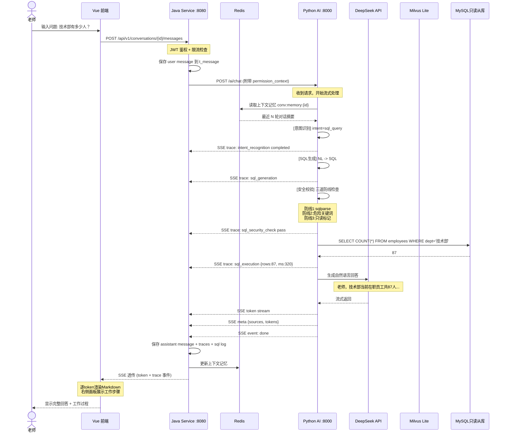
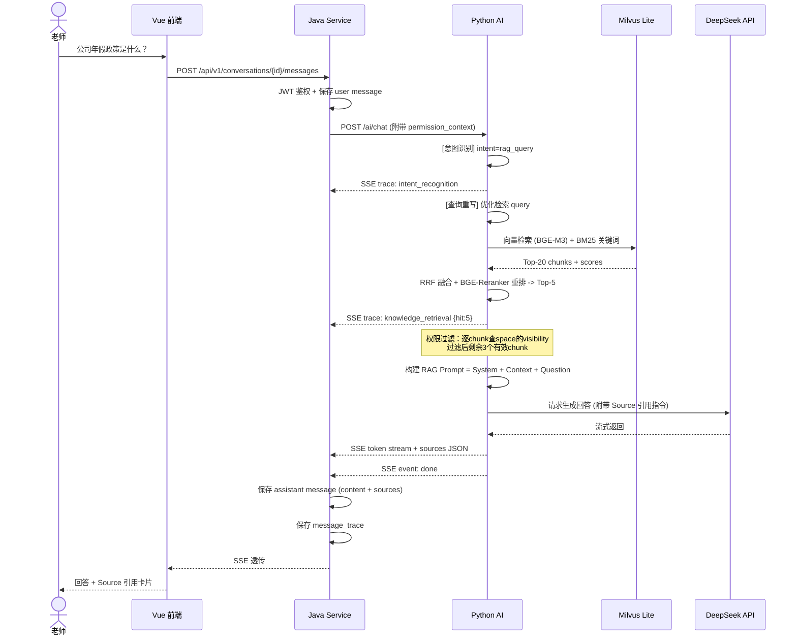
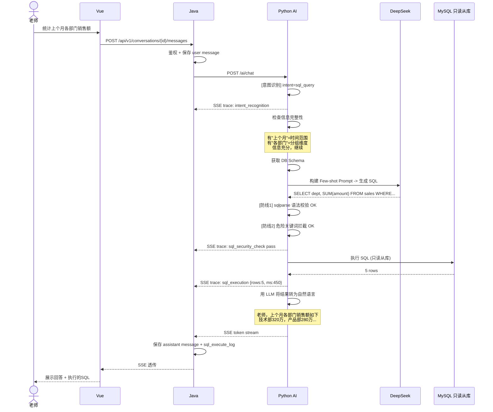
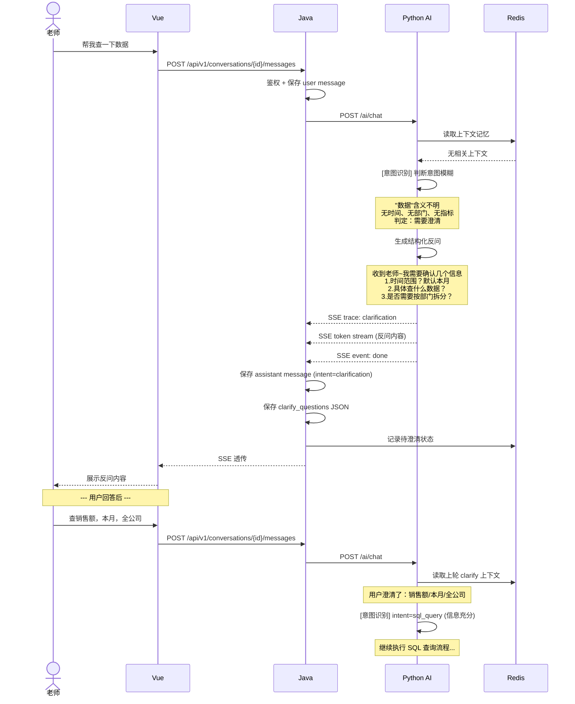
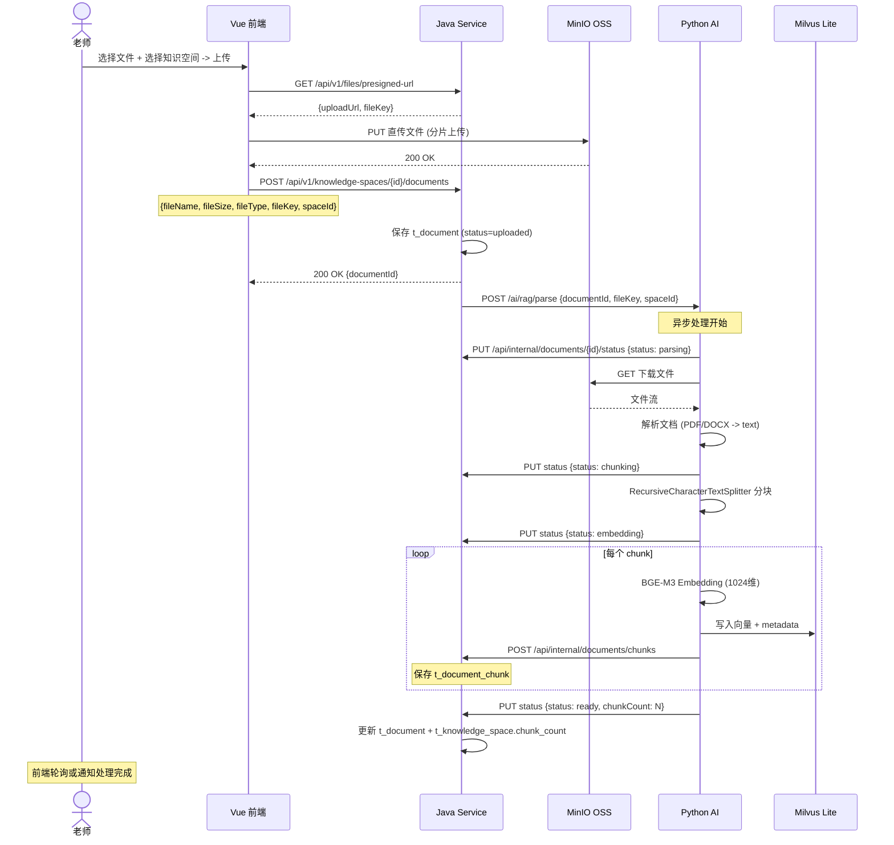
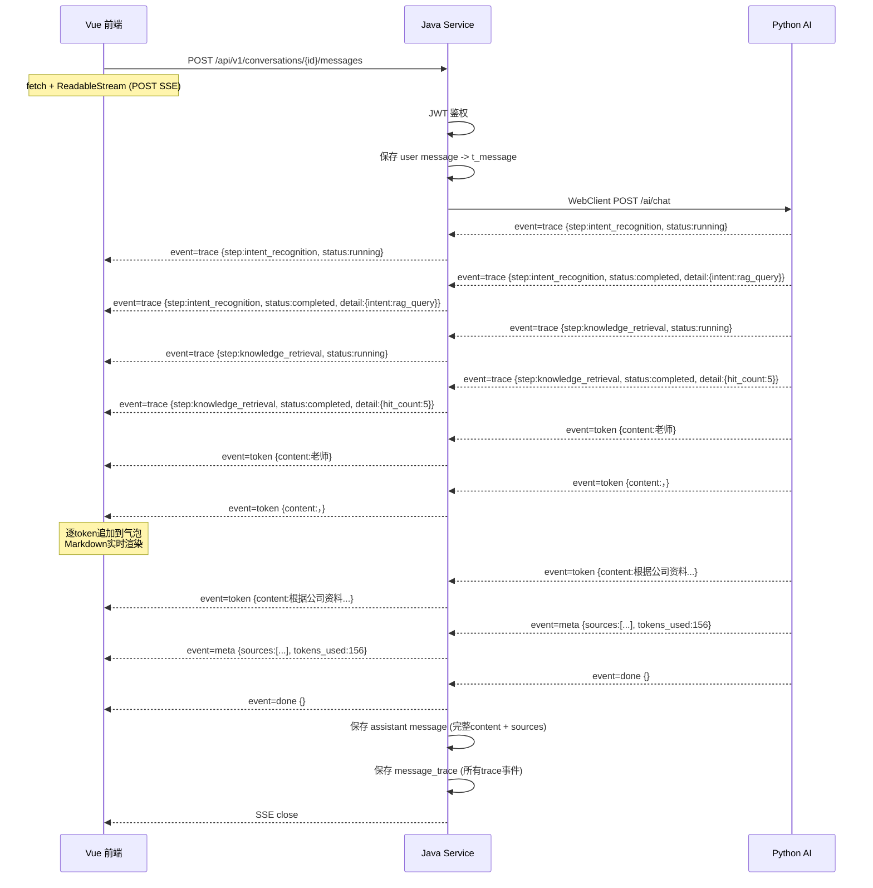

# InternSU 系统架构与服务边界设计 v1.0

> 文档版本: v1.0 | 创建日期: 2026-05-26 | 定位: 系统架构与服务协作定义
> 关联文档: [01-product-definition.md](01-product-definition.md) | [02-database-design.md](02-database-design.md)

---

## 一、系统边界总览

### 1.1 三层边界图

```
+---------------------------------------------------------------------+
|                    Vue 3 前端 (:5777)                                |
|                                                                     |
|  职责: UI 渲染 / 用户交互 / SSE 消费 / Markdown 渲染 / 文件上传       |
|  不负责: 权限判断 / 数据校验 / AI 推理 / 数据库访问                    |
|                                                                     |
|  依赖: Java API (REST) + Python API (SSE 透传)                       |
+-----------------------------------+---------------------------------+
                                    |
             +----------------------+----------------------+
             | REST (JSON)          |                      | SSE
             v                      |                      v
+--------------------------+        |       +------------------------------------+
|  Java Service (:8080)     |        |       |  Python AI Service (:8000)         |
|                           |        |       |                                    |
|  职责:                     |        |       |  职责:                              |
|  - JWT 认证与鉴权          |        |       |  - AI 推理 (LLM 调用)               |
|  - 用户/部门/角色 CRUD     |        |       |  - RAG 检索与混合搜索               |
|  - 会话持久化              |        |       |  - Embedding 生成 (BGE-M3)          |
|  - 消息持久化              |        |       |  - Milvus 向量管理                  |
|  - 文件元数据管理           |        |       |  - SQL 生成与安全校验               |
|  - 知识空间 CRUD           |        |       |  - 文档解析与分块                   |
|  - 系统配置管理             |        |       |  - Prompt 模板渲染 (Jinja2)         |
|  - 操作审计                |        |       |  - 意图识别与路由                   |
|  - Token 黑名单            |        |       |  - AI 反问 (Clarify)               |
|  - 限流控制                |        |       |  - 对话记忆管理 (Redis)             |
|                           |        |       |  - 工作过程追踪生成                  |
|  不负责: AI 推理 / RAG /   |        |       |                                    |
|  Embedding / LLM 调用      |        |       |  不负责: 用户认证 / 权限管理 /       |
|                           |        |       |  业务 CRUD / 文件存储               |
|                           |        |       |                                    |
|  依赖: MySQL + Redis       |        |       |  依赖: Milvus + Redis + LLM API     |
+------------+--------------+        |       +------------------+-----------------+
             |                       |                          |
             v                       |                          v
+----------------------------+       |       +------------------------------------+
|  MySQL 8.0 + Redis 7       |       |       |  Milvus Lite + LLM API              |
|  业务数据 / Token / 缓存    |       |       |  向量检索 / 大模型推理               |
+----------------------------+       |       +------------------------------------+
```

### 1.2 核心原则

| 原则 | 说明 |
|------|------|
| **Vue 不直接调 Python** | 所有 Python 调用由 Java 中转，Java 负责鉴权后再转发 |
| **Python 不处理 JWT** | Python 收到的请求已经过 Java 校验，属于信任方内部调用 |
| **Java 不做 AI 推理** | AI 全部在 Python 侧，Java 是业务编排层 |
| **权限在 Java 侧统一判断** | 知识库可见性过滤的 SQL 由 Java 构建，RAG 结果过滤由 Python 执行但规则来自 Java 传入的 permission_context |
| **文件流不经过 Java** | 大文件由 Vue 直传 OSS（MinIO），Java 只管理元数据 |

---

## 二、服务职责详细定义

### 2.1 Vue 前端

**目录结构**：
```
src/
+-- views/
|   +-- dashboard/          # 工作台
|   +-- chat/               # AI实习生（核心）
|   +-- knowledge/          # 企业知识库
|   +-- system/             # 系统设置
+-- components/
|   +-- chat/
|   |   +-- ChatPanel.vue           # 对话区（中间）
|   |   +-- ConversationList.vue    # 会话列表（左侧）
|   |   +-- MessageBubble.vue       # 消息气泡（Markdown 渲染）
|   |   +-- ChatInput.vue           # 输入框 + 发送
|   |   +-- WorkTracePanel.vue      # 工作过程面板（右侧）
|   +-- knowledge/
|   |   +-- SpaceList.vue           # 知识空间列表
|   |   +-- DocumentTable.vue       # 文档表格
|   |   +-- ChunkPreview.vue        # Chunk 预览
|   +-- common/
|       +-- SourceCitation.vue      # Source 引用展示组件
|       +-- TraceStep.vue           # 工作步骤展示组件
+-- api/
|   +-- auth.ts             # 登录/注册 API
|   +-- conversation.ts     # 会话 CRUD API
|   +-- message.ts          # 消息历史 API
|   +-- knowledge.ts        # 知识空间/文档 API
|   +-- file.ts             # 文件上传 API
|   +-- system.ts           # 系统配置 API
+-- sse/
|   +-- chat-sse.ts         # SSE 流式消费 (fetch + ReadableStream)
+-- stores/
|   +-- auth.ts             # 认证状态 (Pinia)
|   +-- conversation.ts     # 会话状态
|   +-- knowledge.ts        # 知识空间状态
+-- utils/
    +-- markdown.ts         # Markdown 渲染配置
    +-- request.ts          # Axios 封装 (baseURL + interceptor)
```

**Vue 的具体职责**：

| 类别 | 职责 | 关键实现 |
|------|------|------|
| UI 渲染 | 全部页面布局、组件、动画 | Element Plus 组件库 |
| 聊天界面 | 消息列表、气泡样式、输入框、发送按钮 | 虚拟滚动（消息多时） |
| 工作过程展示 | 右侧面板动画展示小SU的分析步骤 | 消费 SSE trace 事件逐条渲染 |
| SSE 流式消费 | 接收 text/event-stream，逐 token 追加到消息气泡 | fetch + ReadableStream（兼容 POST） |
| Markdown 渲染 | 代码高亮、表格、链接、引用块 | marked + highlight.js |
| 文件上传 | 分片上传大文件到 OSS（预签名 URL） | 进度条 + 断点续传 |
| Source 引用展示 | 回答底部显示引用文档卡片，点击可跳转 | 组件化 SourceCitation |
| 状态管理 | 认证 Token、当前会话、知识空间列表 | Pinia |
| 路由守卫 | 未登录跳转登录页、权限不足提示 | Vue Router beforeEach |
| 错误展示 | 网络错误、超时、服务异常的友好提示 | ElMessage + ElNotification |

**Vue 不负责的**：不直接访问 MySQL/Milvus/Redis，不做权限判断（仅展示错误提示），不做 AI 推理逻辑。

---

### 2.2 Java 后端

```
java-service/src/main/java/com/internsu/
+-- auth/                   # 认证授权模块
|   +-- controller/AuthController.java
|   +-- security/JwtTokenProvider.java
|   +-- security/JwtAuthenticationFilter.java
|   +-- service/AuthService.java
+-- user/                   # 用户管理模块
|   +-- controller/UserController.java
|   +-- service/UserService.java
+-- department/             # 部门管理模块
|   +-- controller/DepartmentController.java
|   +-- service/DepartmentService.java
+-- conversation/           # 会话管理模块
|   +-- controller/ConversationController.java
|   +-- service/ConversationService.java
|   +-- entity/Conversation.java, Message.java
+-- knowledge/              # 知识空间模块
|   +-- controller/KnowledgeSpaceController.java
|   +-- controller/DocumentController.java
|   +-- service/KnowledgeSpaceService.java
|   +-- service/DocumentService.java
|   +-- entity/KnowledgeSpace.java
+-- ai/                     # AI 服务代理模块
|   +-- controller/AIChatController.java
|   +-- client/AIServiceClient.java
|   +-- dto/ChatRequest.java, ChatResponse.java
+-- file/                   # 文件服务模块
|   +-- controller/FileController.java
|   +-- service/FileService.java
+-- system/                 # 系统配置模块
|   +-- controller/SystemConfigController.java
|   +-- service/SystemConfigService.java
+-- audit/                  # 审计日志模块
|   +-- service/AuditLogService.java
+-- common/
    +-- config/SecurityConfig.java
    +-- config/RedisConfig.java
    +-- exception/GlobalExceptionHandler.java
    +-- result/Result.java
    +-- annotation/RequirePermission.java
```

**Java 的具体职责**：

| 类别 | 职责 | 关键实现 |
|------|------|------|
| JWT 认证 | 登录签发 Token、请求校验 Token、刷新 | Spring Security + Redis 黑名单 |
| 权限鉴权 | 接口级 RBAC 权限校验 | @RequirePermission 注解 + AOP |
| 用户管理 | 用户 CRUD、部门管理、角色分配 | MyBatis Plus |
| 会话管理 | 会话创建/列表/删除、消息持久化 | conversation + message 表 CRUD |
| 知识空间 | 空间 CRUD + 权限过滤（可见性+部门） | 构建带权限的 WHERE 条件 |
| 文档管理 | 文档元数据 CRUD、处理状态跟踪 | document 表状态机 |
| 文件服务 | 生成 OSS 预签名 URL、文件元数据存储 | MinIO SDK |
| AI 代理 | 接收 Vue 请求 -> 鉴权 -> 转发 Python -> SSE 透传 | WebClient (Spring WebFlux) |
| 限流 | 用户级 API 调用频率限制 | Redis 滑动窗口 |
| 审计 | 操作日志记录 | AOP 切面自动记录 |
| 统一异常 | 全局异常捕获 + 统一 Result 响应格式 | @RestControllerAdvice |

**Java 不负责的**：不做 LLM 调用、Embedding 向量化、文档内容解析、意图识别、RAG 检索。

---

### 2.3 Python AI 服务

```
python-ai-service/app/
+-- main.py                 # FastAPI 入口
+-- core/
|   +-- config.py           # Pydantic Settings
|   +-- logger.py           # 结构化日志
+-- api/v1/
|   +-- chat_api.py         # POST /ai/chat (SSE 流式输出)
|   +-- rag_api.py          # POST /ai/rag/parse (文档处理)
|   +-- health_api.py       # GET /ai/health
|   +-- internal_api.py     # Java 内部回调接口
+-- router/
|   +-- graph.py            # LangGraph StateGraph (意图路由)
|   +-- nodes/
|   |   +-- intent_node.py      # 意图识别节点
|   |   +-- rag_node.py         # RAG 检索节点
|   |   +-- sql_node.py         # SQL 生成与执行节点
|   |   +-- clarify_node.py     # 反问澄清节点
|   |   +-- answer_node.py      # 最终回答生成节点
|   +-- state.py            # GraphState 定义
+-- llm/
|   +-- gateway.py          # LLM Gateway (多 Provider)
|   +-- openai_provider.py
|   +-- deepseek_provider.py
+-- rag/
|   +-- parser.py           # 文档解析 (PDF/DOCX/MD/TXT)
|   +-- splitter.py         # 文本分块 (RecursiveCharacterTextSplitter)
|   +-- embedder.py         # BGE-M3 Embedding 生成
|   +-- retriever.py        # 混合检索 (向量+BM25+RRF+Reranker)
|   +-- indexer.py          # 文档索引编排器
|   +-- permission_filter.py # 权限过滤
+-- sql/
|   +-- generator.py        # NL2SQL (LLM 生成 SQL)
|   +-- security.py         # SQL 安全校验 (sqlparse+关键词拦截)
|   +-- executor.py         # SQL 执行器 (连接只读从库)
+-- prompt/
|   +-- manager.py          # Prompt Manager (DB查询+Jinja2渲染)
|   +-- internsu_prompts.py # 小SU 人格 Prompt 定义
+-- memory/
|   +-- memory_manager.py   # Redis 对话记忆 (滑动窗口)
+-- trace/
|   +-- trace_builder.py    # 工作过程追踪记录生成
+-- middleware/
    +-- auth_middleware.py   # 内部调用认证 (API Key)
    +-- logging_middleware.py
```

**Python 的具体职责**：

| 类别 | 职责 | 关键实现 |
|------|------|------|
| LLM 推理 | 调用 DeepSeek/OpenAI API，流式返回 | LangChain ChatModel + streaming |
| 意图识别 | 判断用户意图: 闲聊/RAG/SQL/澄清 | LLM 分类 + 规则兜底 |
| RAG 检索 | 文档解析->分块->向量化->混合检索->重排序 | LangChain + Milvus + BGE-M3 |
| SQL Agent | NL2SQL 生成 + 安全校验 + 只读执行 | LangChain + 三道防线 |
| AI 反问 | 信息不足时主动澄清 | 意图识别判定 + 反问模板 |
| Prompt 管理 | DB 加载模板 -> Jinja2 渲染 -> 注入 LLM | 模板缓存 + 版本管理 |
| 对话记忆 | Redis 滑动窗口管理多轮上下文 | 轮次摘要 + 关键实体持久化 |
| 工作过程追踪 | 生成实时 trace 事件，通过 SSE 推送 | trace_builder 节点产出事件 |
| Embedding | 文档分块向量化 (BGE-M3) | 批量调用 Embedding API |
| Milvus 管理 | 向量写入、检索、删除 | Milvus Lite 嵌入式模式 |

**Python 不负责的**：不处理用户认证、文件存储、知识空间元数据 CRUD、前端渲染。

---

## 三、核心调用链 Mermaid 图

### 3.1 AI 聊天完整流程



### 3.2 RAG 知识问答流程



### 3.3 SQL 查询流程



### 3.4 AI 反问（Clarify）流程



### 3.5 文件上传与文档解析流程



### 3.6 SSE 流式架构详细



**SSE 事件类型规范**：

| event 类型 | data 结构 | 触发时机 | Vue 行为 |
|------|------|------|------|
| trace | {step, status, step_order?, detail?, duration_ms?} | 每个工作步骤开始/完成 | 右侧面板更新步骤状态 |
| token | {content} | LLM 逐 token 输出 | 追加到当前 assistant 消息气泡末尾 |
| meta | {sources, tokens_used, model_name} | 回答完成时 | 保存元数据，展示 Source 引用 |
| error | {code, message, detail?} | 任何步骤出错 | 展示错误提示 |
| done | {} | 整个流程结束 | 关闭 SSE 连接，标记消息完成 |

---

## 四、完整 API 列表

### 4.1 统一响应格式

```json
{
  "code": 200,
  "message": "success",
  "data": {},
  "timestamp": 1716720000000
}
```

### 4.2 Java REST API（前端直接调用）

#### 认证模块

| 方法 | 路径 | 说明 | 请求体 | 响应 data |
|------|------|------|------|------|
| POST | /api/v1/auth/login | 登录 | {username, password} | {accessToken, refreshToken, expiresIn, userInfo} |
| POST | /api/v1/auth/register | 注册 | {username, password, email, nickname} | {userId} |
| POST | /api/v1/auth/refresh | 刷新Token | {refreshToken} | {accessToken, expiresIn} |
| POST | /api/v1/auth/logout | 登出 | - | - |
| GET | /api/v1/auth/me | 当前用户信息 | - | {id, username, nickname, email, department, roles} |

#### 用户与部门

| 方法 | 路径 | 说明 | 权限 |
|------|------|------|------|
| GET | /api/v1/users | 用户列表（分页） | admin |
| GET | /api/v1/users/{id} | 用户详情 | admin |
| PUT | /api/v1/users/{id} | 编辑用户 | admin |
| PUT | /api/v1/users/password | 修改密码 | 登录用户 |
| GET | /api/v1/departments | 部门树 | 登录用户 |
| POST | /api/v1/departments | 创建部门 | admin |
| PUT | /api/v1/departments/{id} | 编辑部门 | admin |
| DELETE | /api/v1/departments/{id} | 删除部门 | admin |

#### 会话模块

| 方法 | 路径 | 说明 |
|------|------|------|
| GET | /api/v1/conversations | 会话列表（分页，按 update_time DESC） |
| POST | /api/v1/conversations | 创建新会话 {title?, spaceId?} |
| GET | /api/v1/conversations/{id} | 会话详情 + 最近消息 |
| PUT | /api/v1/conversations/{id} | 重命名会话 {title} |
| DELETE | /api/v1/conversations/{id} | 删除会话（逻辑删除） |
| GET | /api/v1/conversations/{id}/messages | 消息列表（分页） |
| POST | /api/v1/conversations/{id}/messages | **发送消息（核心接口）** {content, modelName?} -> **SSE 响应** |
| GET | /api/v1/conversations/{id}/messages/{msgId}/traces | 消息的工作过程 |

#### 知识空间模块

| 方法 | 路径 | 说明 |
|------|------|------|
| GET | /api/v1/knowledge-spaces | 知识空间列表（权限过滤） |
| POST | /api/v1/knowledge-spaces | 创建知识空间 {name, description, visibility, departmentId?} |
| GET | /api/v1/knowledge-spaces/{id} | 知识空间详情 |
| PUT | /api/v1/knowledge-spaces/{id} | 编辑知识空间 |
| DELETE | /api/v1/knowledge-spaces/{id} | 删除知识空间（级联删文档+Milvus向量） |

#### 文档模块

| 方法 | 路径 | 说明 |
|------|------|------|
| GET | /api/v1/knowledge-spaces/{spaceId}/documents | 文档列表 |
| POST | /api/v1/knowledge-spaces/{spaceId}/documents | 上传文档元数据 {fileName, fileSize, fileType, fileKey} |
| GET | /api/v1/documents/{id} | 文档详情 |
| DELETE | /api/v1/documents/{id} | 删除文档（级联删 chunk + Milvus 向量） |
| GET | /api/v1/documents/{id}/chunks | 文档 Chunk 列表（分页） |
| POST | /api/v1/documents/{id}/retry | 重新处理失败文档 |
| GET | /api/v1/files/presigned-url | 获取 OSS 预签名上传 URL ?fileName=xxx&fileType=pdf |

#### 系统配置

| 方法 | 路径 | 说明 | 权限 |
|------|------|------|------|
| GET | /api/v1/system/configs | 配置列表 | admin |
| PUT | /api/v1/system/configs/{key} | 更新配置 {value} | admin |
| GET | /api/v1/system/configs/public | 公开配置（前端需要） | 登录用户 |
| GET | /api/v1/dashboard/stats | 工作台统计数据 | 登录用户 |

---

### 4.3 Python API（Java 内部调用，不暴露给前端）

**认证方式**：请求头 X-API-Key: {内部密钥}

#### AI 聊天

| 方法 | 路径 | 说明 |
|------|------|------|
| POST | /ai/chat | SSE 流式聊天（核心接口） |
| POST | /ai/chat/sync | 同步聊天（非流式，调试用） |

**POST /ai/chat 请求体**：
```json
{
  "user_id": 5,
  "conversation_id": 42,
  "message_id": 128,
  "content": "技术部有多少人？",
  "model_name": "deepseek-v3",
  "space_id": null,
  "permission_context": {
    "user_id": 5,
    "department_id": 3,
    "department_path": "/1/3",
    "allowed_space_ids": [1, 2, 5, 8]
  }
}
```

#### RAG 文档处理

| 方法 | 路径 | 说明 |
|------|------|------|
| POST | /ai/rag/parse | 解析文档+分块+向量化（异步） |
| POST | /ai/rag/search | 知识检索测试（同步） |
| DELETE | /ai/rag/documents/{docId} | 删除文档的 Milvus 向量 |

**POST /ai/rag/parse 请求体**：
```json
{
  "document_id": 15,
  "file_key": "kb/12/abc123.pdf",
  "space_id": 3,
  "chunk_size": 512,
  "chunk_overlap": 64
}
```

**POST /ai/rag/search 请求体**：
```json
{
  "query": "年假政策",
  "space_ids": [1, 3],
  "top_k": 5,
  "permission_context": { "user_id": 5, "department_id": 3, "department_path": "/1/3" }
}
```

**POST /ai/rag/search 响应**：
```json
{
  "chunks": [
    {
      "chunk_id": 128,
      "document_id": 42,
      "document_name": "员工手册2025.pdf",
      "content": "员工每年享有带薪年假...",
      "page_number": 12,
      "score": 0.92
    }
  ],
  "total_hits": 20,
  "filtered_count": 5
}
```

#### 内部回调接口（Python -> Java）

| 方法 | 路径 | 说明 |
|------|------|------|
| PUT | /api/internal/documents/{id}/status | Python 更新文档处理状态 |
| POST | /api/internal/documents/{id}/chunks | Python 写入 chunk 元数据 |
| PUT | /api/internal/knowledge-spaces/{id}/counts | Python 更新 chunk 计数 |

---

## 五、关键架构专项设计

### 5.1 文件上传链路

```
Vue 选择文件
    |
    v
(1) GET /api/v1/files/presigned-url?fileName=xxx&fileType=pdf
    |
    v
Java 生成预签名 URL (PUT, 有效期 10min)
    |
    v
(2) Vue 直接 PUT 文件到 OSS (MinIO) -- 不经过 Java 内存
    |
    v
(3) Vue POST /api/v1/knowledge-spaces/{id}/documents
    { fileName, fileSize, fileType, fileKey }
    |
    v
Java 保存 t_document (status=uploaded)
    |
    v
(4) Java POST /ai/rag/parse -> Python AI
    |
    v
Python: 下载 OSS 文件 -> 解析 -> 分块 -> Embedding -> Milvus
    |
    v
Python 回调 Java:
    PUT /api/internal/documents/{id}/status  (更新状态)
    POST /api/internal/documents/{id}/chunks (写入 chunk 元数据)
```

**谁负责什么**：
- **Vue**: 选择文件、调用预签名 URL、直传 OSS、提交元数据
- **Java**: 生成预签名 URL、管理 document 元数据、状态机流转、接收 Python 回调
- **Python**: 下载文件、解析文档内容、文本分块、Embedding、写入 Milvus
- **OSS**: 文件存储（MinIO），不经过任何服务内存

### 5.2 RAG 检索链路

```
用户问题 "公司年假政策是什么？"
    |
    v
Python: [查询重写] -> "企业年假 假期政策 规定天数"
    |
    v
Python: [Query Embedding] BGE-M3 -> 1024维向量
    |
    v
Milvus: 向量相似度检索 (Top-20) + BM25 关键词检索
    |
    v
Python: RRF 融合排序 -> Top-10
    |
    v
Python: BGE-Reranker 重排序 -> Top-5
    |
    v
Python: [权限过滤]
    逐chunk查所属 document -> space -> visibility
    visibility=public            -> 保留
    visibility=department        -> 用户部门在space部门子树内 -> 保留
    visibility=private           -> creator_id=userId -> 保留
    其他                          -> 丢弃
    |
    v
Python: 构建 RAG Prompt = System + Context + Question
    |
    v
LLM 生成回答 + Source 引用标注
    |
    v
SSE 流式返回 (含 sources JSON)
```

### 5.3 SQL Agent 三道防线

```
用户自然语言问题
    |
    v
Python: [意图识别] intent=sql_query
    |
    v
检查信息充分性 -> 不充分 -> [Clarify 反问]
    | 充分
    v
Python: 获取数据库 Schema
    |
    v
Python: Few-shot Prompt -> LLM 生成 SQL
    |
    v
+---------------------------------------------------+
| 防线1: sqlparse 语法解析                            |
|   -> 解析为 AST -> 判断是否为合法 SQL               |
|   -> 失败 -> SSE error + 记录 blocked              |
|   -> 通过 向下                                      |
+---------------------------------------------------+
| 防线2: 危险关键词扫描                               |
|   BLACKLIST: DROP, ALTER, TRUNCATE, INSERT,        |
|     UPDATE, DELETE, CREATE, GRANT                  |
|   ALLOWLIST: SELECT, SHOW, DESCRIBE, EXPLAIN       |
|   -> 命中黑名单 -> SSE error + 记录 blocked         |
|   -> 通过 向下                                      |
+---------------------------------------------------+
| 防线3: 只读从库执行                                  |
|   -> 连接字符串指向只读副本                          |
|   -> DB 用户仅有 SELECT 权限                       |
|   -> 物理层面无法执行写操作                          |
+---------------------------------------------------+
    |
    v
执行 SQL -> 记录 sql_execute_log -> 返回结果
    |
    v
LLM 将结果转为自然语言 -> 回答中提示"本次仅执行只读查询"
```

### 5.4 Clarify 反问机制

**触发条件判断逻辑**：

- 意图无法识别 (unknown) -> 澄清
- SQL 查询缺少必要实体 (metric/time_range) -> 澄清
- RAG 查询关键词太少 (< 2) -> 澄清
- 上轮刚澄清过 -> 不澄清，直接执行

**上下文保存**：
- 反问和回答都作为普通 message 存入 t_message
- assistant 反问消息的 intent=clarification，clarify_questions 字段存结构化问题
- 用户回答后，Python 从 Redis 读取上轮 clarify 上下文 + 本轮回答 -> 补全实体 -> 继续

---

## 六、错误处理设计

### 6.1 错误分级

| 级别 | 场景 | 用户提示 | 系统处理 |
|------|------|------|------|
| L1 用户侧 | 输入为空 | 老师，您还没输入问题呢~ | Vue 前端拦截 |
| L1 用户侧 | Token 过期 | 登录已过期，请重新登录 | Java 返回 401 |
| L2 业务侧 | 知识库无结果 | 老师，我在公司资料里没有找到相关信息 | Python 正常返回 |
| L2 业务侧 | SQL 被拦截 | 老师，这个查询涉及写操作，我只能执行只读查询~ | Python SSE error |
| L3 系统侧 | LLM 超时 | 老师，我正在努力思考... -> 30s后: 抱歉老师，我好像卡住了 | Python 重试3次后 error |
| L3 系统侧 | Python 不可用 | 小SU暂时不在座位上，请稍后再试 | Java 返回 503 |
| L3 系统侧 | SSE 连接中断 | 连接似乎断开了，正在重新连接... | Vue onerror 重连 |
| L4 运维侧 | 文件解析失败 | 老师，这份文档我解析失败了，建议转成 PDF 再试试 | Python 回调 Java 标记 failed |
| L4 运维侧 | Milvus 不可用 | 知识库暂时无法检索，但我会尽力回答 | Python 降级为纯 LLM |

### 6.2 小SU 的错误话术

| 错误场景 | 小SU 的话术 |
|------|------|
| RAG 无结果 | 老师，我在公司资料里没有找到相关信息。您方便提供更多线索吗？ |
| SQL 被拦截 | 老师，这个查询涉及到了修改数据的操作，我只能帮您执行只读查询。要不换个方式问？ |
| LLM 超时 | 抱歉老师，这个问题有点复杂，我正在努力思考…（30s后）老师，我好像卡住了，您能重新问我一次吗？ |
| 文件解析失败 | 老师，这份文档的格式我不太能识别。建议把它转成 PDF 后重新上传，我能更好地帮您处理。 |
| 服务不可用 | 老师，我暂时不在座位上。请稍等一下，马上回来~ |

---

## 七、开发联调检查清单

### 1. 最先开发的接口（按依赖顺序）

| 序号 | 接口 | 理由 |
|------|------|------|
| (1) | POST /api/v1/auth/login | 所有接口依赖 JWT |
| (2) | GET /api/v1/auth/me | 前端需要用户信息渲染 UI |
| (3) | GET /api/v1/departments | 知识空间创建依赖部门数据 |
| (4) | POST /api/v1/conversations | 聊天前必须先有会话 |
| (5) | POST /api/v1/conversations/{id}/messages (SSE) | **核心链路，打通即过半** |
| (6) | POST /api/v1/knowledge-spaces | 知识库基础 CRUD |
| (7) | GET /api/v1/files/presigned-url | 文件上传前置 |
| (8) | POST /api/v1/knowledge-spaces/{id}/documents | 文档管理 |
| (9) | POST /ai/rag/parse (Python) | 文档处理 |

### 2. 需要联调的接口

| 涉及方 | 接口 | 关键验证点 |
|------|------|------|
| Vue <-> Java | 登录 + Token 刷新 | Token 存储于 localStorage，请求拦截器自动附加 |
| Vue <-> Java (SSE) | 发送消息 | fetch + ReadableStream 能否正确接收 event 流 |
| Java <-> Python | /ai/chat (SSE) | Java WebClient 能否消费 SSE 并逐 event 透传 |
| Java <-> Python | /ai/rag/parse | Python 异步处理完成后是否回调 Java |
| Python <-> Milvus | 向量写入+检索 | milvus_id 与 MySQL document_chunk 一致 |
| Python <-> Redis | 对话记忆读写 | Key 格式、TTL、序列化方式 |

### 3. Vue 先调谁

```
开发顺序:
  1. 先调 Java REST API (登录/会话列表/知识空间列表)
     -> 验证 Axios 封装、Token 拦截器、统一错误处理
  2. 再联 Java SSE (聊天)
     -> 验证 fetch + ReadableStream
  3. 最后联 Python SSE trace 事件
     -> 验证右侧面板工作过程展示

Vue 永远不直接调 Python。
```

### 4. Java 如何连接 Python

使用 Spring WebFlux 的 WebClient 消费 SSE 流并透传给 Vue：

```
WebClient.post()
    .uri("http://localhost:8000/ai/chat")
    .header("X-API-Key", internalApiKey)
    .bodyValue(pythonRequest)
    .accept(MediaType.TEXT_EVENT_STREAM)
    .retrieve()
    .bodyToFlux(ServerSentEvent.class)
    .doOnNext(event -> {
        if ("done".equals(event.event())) {
            saveAssistantMessage(...);
            saveTraces(...);
        }
    });
```

### 5. SSE 最容易出错的地方

| 问题 | 现象 | 解决方案 |
|------|------|------|
| **EventSource 不支持 POST** | 前端只能用 GET 发 SSE | 改用 fetch + ReadableStream |
| **Nginx/网关缓冲 SSE** | 用户看到整段回答而非流式 | proxy_buffering off + X-Accel-Buffering: no |
| **Java 中转时提前关闭流** | Python 还在推，Java 已断开 | WebClient responseTimeout(5min) |
| **trace 事件乱序** | 前端步骤顺序混乱 | Python 在 trace 事件中带 step_order |
| **token 事件丢失** | 回答内容不完整 | 前端收到 done 后对比 tokens_used |

### 6. 后面一定会改的接口

| 接口 | 原因 |
|------|------|
| POST /conversations/{id}/messages | 当前 POST+SSE，后续可能改 WebSocket |
| POST /ai/rag/parse | 大文档需改消息队列异步 |
| GET /dashboard/stats | 后续需 Token 统计、图表 |
| GET /knowledge-spaces | 部门树层级深时需优化 SQL |

### 7. 如何验证整个链路

```
端到端验证流程:

1. 启动 MySQL + Redis + Milvus (docker-compose up)
2. 启动 Java Service -> 验证 /actuator/health
3. 启动 Python AI -> 验证 /ai/health
4. 启动 Vue Dev Server -> 验证登录页
5. 登录 -> 验证 JWT 签发 + Token 存储
6. 创建知识空间 -> 验证 visibility 字段写入
7. 上传 PDF -> 验证 OSS 直传 + Python 解析 + Milvus 写入
8. 发送"公司年假政策" -> 验证 RAG 检索 + Source 引用
9. 发送"技术部有多少人" -> 验证 SQL 生成 + 安全校验 + 执行
10. 发送模糊问题"查数据" -> 验证 Clarify 反问
11. 查看右侧面板 -> 验证 trace 事件实时展示
12. 会话列表 -> 验证消息持久化 + 历史记录加载

全部通过 = 核心链路打通
```

---

> **文档结束** | 下一文档：04-ui-interaction-design.md（前端交互设计）
